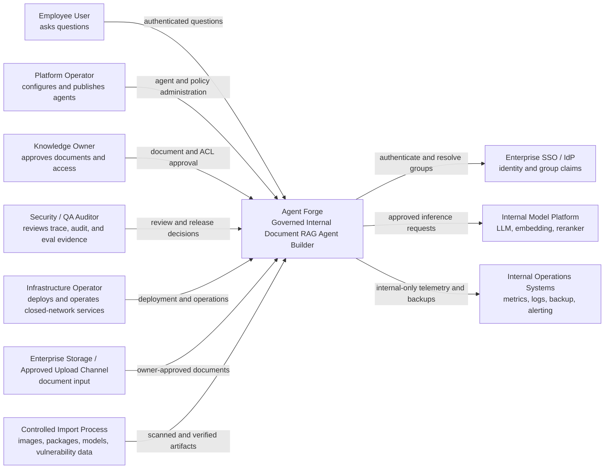
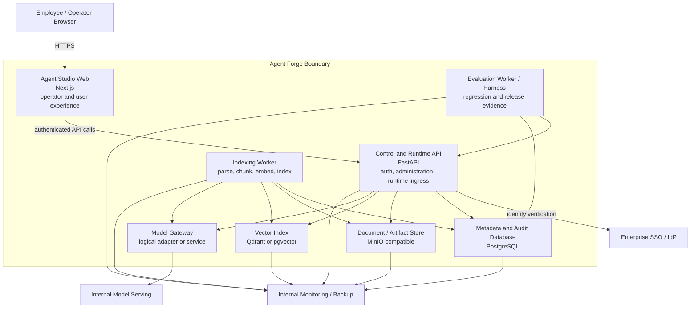
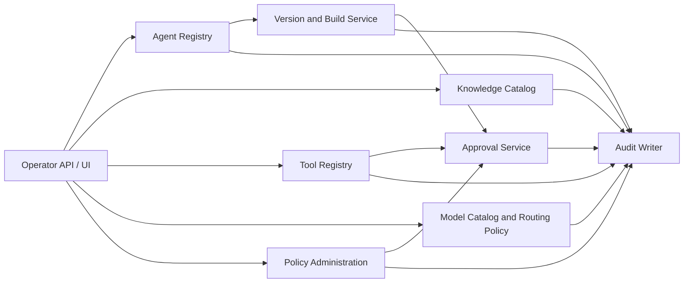
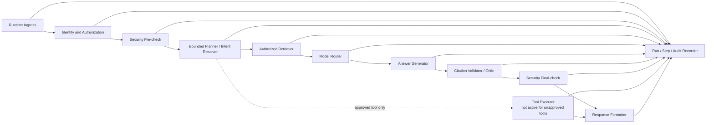
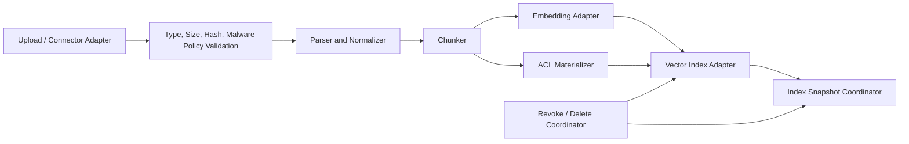
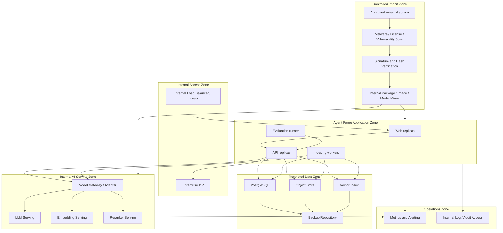

# Agent Forge C4 Architecture Baseline

Status: Draft architecture baseline  
Owner: Product Architect  
Related: #108, #112

## 1. Purpose

This document describes Agent Forge at four levels:

1. System Context — who uses the system and which external enterprise systems it depends on.
2. Containers — the major deployable or independently operated responsibilities.
3. Components — the logical responsibilities inside the application and workers.
4. Deployment — how those responsibilities are expected to run in a closed-network environment.

The diagrams describe the **governed target shape for the current product boundary**. They do not claim that every logical container is already deployed as a separate process. The current technical MVP may co-locate multiple responsibilities inside the FastAPI API, Next.js web application, worker commands, and shared infrastructure.

## 2. Architectural Drivers

- Closed-network operation with outbound internet disabled by default.
- Authorization before relevance for every knowledge retrieval path.
- Versioned Agent execution with reproducible model, prompt, policy, tool, and knowledge references.
- Cited answer or safe refusal when authorized evidence is insufficient.
- Auditability of administrative changes, policy decisions, retrieval, model routing, and release evidence.
- Adapter-based internal model and vector-store integration.
- No unregistered product runtime tools.
- Separation between project delivery orchestration and the end-user product runtime.
- Technical MVP evidence must remain distinct from pilot and production readiness.

## 3. System Context

### 3.1 People and responsibilities

| Person or role | Primary responsibility | Must not be assumed |
|---|---|---|
| Employee User | Ask questions through a published Agent and receive a cited answer or refusal | Administrative or document-owner authority |
| Platform Operator | Configure Agents, validate versions, publish approved versions, inspect traces | Authority to approve every document or override security policy |
| Knowledge Owner | Approve document ingestion, classification, lifecycle, and ACL mapping | Platform-wide release authority |
| Security / QA Auditor | Inspect authorization, audit, evaluation, and release evidence | Implementation ownership for the change being judged |
| Infrastructure Operator | Operate the platform, model endpoints, storage, backup, and monitoring | Product scope authority |
| Accountable Business Owner | Accept pilot outcome and business risk | Technical implementation detail ownership |

### 3.2 External dependencies

| Dependency | Required for technical MVP | Required for pilot | Boundary rule |
|---|---:|---:|---|
| Enterprise SSO / IdP | Simulated/local principal is sufficient for development evidence | Yes | Identity claims must be server-trusted and fail closed |
| Internal model platform | Adapter/fallback sufficient for development evidence | Yes | Only approved endpoints and models |
| Approved document input | Fixtures/demo documents sufficient for development evidence | Yes | Named owner and ACL required before indexing |
| Internal observability and backup | CI/local logging sufficient for development evidence | Yes | Logs remain internal and secrets/content are redacted |
| Controlled import process | Design and local dependency lock are sufficient for development | Yes | Artifacts require scanning, hash verification, and promotion records |

## 4. Container View

### 4.1 Container responsibilities

| Container | Responsibilities | Authoritative data | Current physical note |
|---|---|---|---|
| Agent Studio Web | Agent administration, document workflows, runtime question UI, trace/audit/eval views | None; API remains authoritative | Implemented as the Next.js web application |
| Control and Runtime API | Authentication context, agent/version lifecycle, runtime ingress, policy coordination, retrieval orchestration, trace and audit APIs | Transactional domain state in PostgreSQL | Multiple logical components may be co-located in the FastAPI application |
| Indexing Worker | File validation, parsing, normalization, chunking, embedding, vector update, index-job status | Job state in PostgreSQL; raw file in object store; vectors in vector index | May run as a worker command/process rather than independent service |
| Evaluation Worker / Harness | Execute eval corpus, deterministic scoring, persist results, compare baseline, prepare release evidence | Eval definitions/results in repository and PostgreSQL | Repository eval harness plus API-backed workflows |
| Metadata and Audit Database | Agents, versions, knowledge metadata, ACL, jobs, runs, steps, retrieval hits, audit, eval, approvals, settings | Primary system-of-record for transactional metadata | PostgreSQL |
| Document / Artifact Store | Original approved documents and generated artifacts | Binary object content and checksum-addressed artifacts | MinIO-compatible target; environment may vary |
| Vector Index | Chunk embeddings and searchable ACL metadata | Search index, not the authoritative original document | Qdrant or pgvector adapter |
| Model Gateway | Validate and route requests to approved LLM, embedding, and reranker models; normalize failures and trace metadata | Model catalog references remain in metadata store | May initially be an application-layer adapter rather than separate service |

### 4.2 Container invariants

1. The browser never directly accesses the database, object store, vector index, or model platform.
2. The API derives trusted Principal context from the approved identity integration; user-supplied identity headers are development-only.
3. The vector index is not the source of truth for document ownership or ACL policy.
4. An Indexing Worker cannot grant access; it materializes owner-approved metadata.
5. The Model Gateway cannot expand document access or tool permissions.
6. Evaluation may read trace and configured test evidence but must not mutate production domain state except through approved test APIs or isolated environments.
7. Every consequential administrative change creates an Audit Event.

## 5. Logical Component View

The following views are logical. Components may be modules inside one deployable API during the MVP.

### 5.1 Control Plane components

| Component | Owns | Does not own |
|---|---|---|
| Agent Registry | Logical Agent identity, name, purpose, owner, lifecycle metadata | Runtime conversation state |
| Version and Build Service | Agent Version validation, immutable Build identity, publish/supersede coordination | Model execution |
| Knowledge Catalog | Knowledge Source, Document metadata, owner, classification, ACL reference, index status | Raw binary storage implementation |
| Tool Registry | Product Tool and Tool Version metadata, risk, schema, owner, allowlist | Development MCP registry |
| Model Catalog and Routing Policy | Approved model references and routing constraints | Model weights or serving infrastructure |
| Policy Administration | Versioned security/runtime policy references | Authentication provider itself |
| Approval Service | Approval request and decision lifecycle for publish or future side effects | Automatic assumption of human consent |
| Audit Writer | Durable audit event creation | General application debug logging |

### 5.2 Runtime Plane components

| Component | Mandatory behavior |
|---|---|
| Runtime Ingress | Issue request/run identity and bind authenticated Principal and Agent Version/Build |
| Identity and Authorization | Verify Agent execution permission and construct trusted group/role context |
| Security Pre-check | Reject prohibited input before retrieval or model generation |
| Bounded Planner / Intent Resolver | Select only intents, knowledge sources, and tools allowed by the Agent Version |
| Authorized Retriever | Apply ACL in the search query, rerank only allowed chunks, emit citation locators |
| Model Router | Select only approved model routes and capture route/failure metadata |
| Answer Generator | Generate only from supplied authorized context and instructions |
| Citation Validator / Critic | Verify material claim support; at most the configured bounded rewrite attempt |
| Security Final-check | Detect prohibited disclosure, overexposure, and policy violations before response |
| Tool Executor | Execute only registered and authorized Tool Versions; future write actions require approval policy |
| Run / Step / Audit Recorder | Persist sufficient trace to reconstruct decisions; audit failure must follow fail-closed policy where required |

### 5.3 Data Plane components

Data-plane invariants:

- A Document without an accountable owner and access policy does not enter an active index.
- Every Chunk retains Document identity, source locator, checksum lineage, and ACL materialization metadata.
- The vector index stores only the data needed for search and authorization filtering; the original Document remains authoritative in object storage and metadata.
- ACL changes invalidate affected chunks, vectors, caches, and index-snapshot references according to policy.
- Revoke and delete operations must be observable and testable; a logically revoked Document must not remain retrievable.

### 5.4 Model Plane components

| Component | Responsibility |
|---|---|
| Model Catalog | Approved provider/model IDs, task eligibility, data restrictions, capacity and lifecycle metadata |
| Chat Adapter | Normalize internal LLM request/response and failure behavior |
| Embedding Adapter | Generate embeddings under approved model/version and dimensional contract |
| Reranker Adapter | Score only already-authorized retrieval candidates |
| Route Trace | Persist selected route, model reference, fallback, latency, and error category without storing secrets |

### 5.5 Delivery Plane components

The Delivery Plane is outside the end-user Agent Forge runtime.

| Component | Responsibility | Boundary |
|---|---|---|
| PM Orchestrator | Product scope, sequence, gates, integration, escalation | Cannot silently grant product runtime authority |
| Specialist Agents | Bounded design, implementation, review, and evaluation work | Defined by Agent Contracts and Work Orders |
| Skills and Hooks | Reusable instructions and deterministic lifecycle controls | Repository/development controls, not production authorization |
| Development MCP Registry | Approved development connectors and actions | Separate from Product Tool Registry |
| Evidence Packages | Reproducible completion and release evidence | Support human decisions; do not replace them |

## 6. Deployment View

### 6.1 Closed-network target deployment

### 6.2 Deployment rules

- No direct outbound internet from application, data, or model zones.
- Imported artifacts are scanned, verified, promoted, and traceable.
- Secrets are mounted from an approved internal secret mechanism and never committed to the repository or exposed in traces.
- Identity, data, model, and operations network paths are allowlisted.
- Administrative access is separated from employee query access.
- Audit and security logs have stricter access than general operational logs.
- Backup and restore are tested against explicit RTO/RPO before pilot GO.
- High availability, capacity, and retention values are environment decisions, not inferred from this logical model.

## 7. Authoritative Ownership Matrix

| Information | Authoritative owner/store | Derived copies |
|---|---|---|
| Agent identity and ownership | Agent Registry / PostgreSQL | UI caches, trace references |
| Agent Version and Build references | Version and Build Service / PostgreSQL | Runtime state, evaluation evidence |
| Document binary | Object Store | Parser working files, controlled artifacts |
| Document metadata and ACL | Knowledge Catalog / PostgreSQL | Chunk metadata, vector payload, cache |
| Chunk text and lineage | Chunk metadata store / PostgreSQL or approved store | Model context, vector payload excerpt |
| Embedding search index | Vector Index | None treated as source of truth |
| Principal and group claims | Enterprise IdP at authentication time | Bounded trusted request context, audited references |
| Run and steps | Runtime trace store / PostgreSQL | UI projections, evidence packages |
| Audit events | Audit store / PostgreSQL append-oriented table or approved audit sink | Auditor UI projections |
| Evaluation definitions | Version-controlled repository | Database execution copies |
| Evaluation results | Eval store / PostgreSQL plus generated evidence | Reports and release decisions |
| Product Tool approvals | Product Tool Registry / PostgreSQL | Runtime allowlist cache |
| Development tool approvals | Delivery Harness repository registry | Development client configuration |

## 8. Architecture Conformance Questions

Every later design or implementation slice must answer:

1. Which container and logical component owns the change?
2. Which authoritative store changes?
3. Which trust boundary is crossed?
4. How is Principal identity established and revalidated?
5. Can unauthorized data enter retrieval, reranking, model context, response, trace, or logs?
6. What state transition occurs and who is allowed to trigger it?
7. Which audit event and evaluation evidence are required?
8. Does the change expose a development capability to product runtime?
9. Is the change current pilot scope, conditional scope, later candidate, or non-goal?
10. What is the fail-closed behavior?

## 9. Relationship to Existing Documents

- `docs/architecture.md` remains the original architecture description and source material.
- `docs/agent-build-spec.md` remains the detailed Agent Build contract source.
- `docs/implementation-plan.md` remains implementation planning and historical intended layout.
- This document becomes the concise C4 baseline after review and merge.
- Trust-boundary details and Product/Development MCP contracts are expanded in the next architecture-recovery slice.