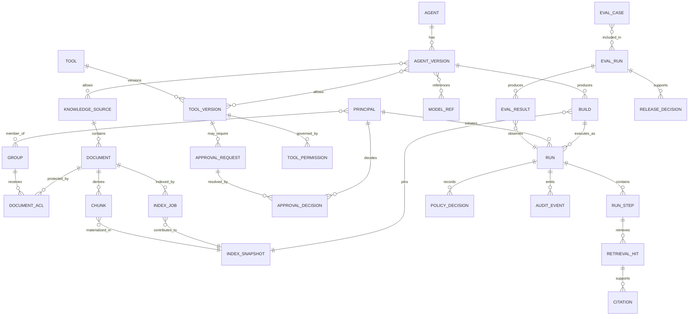

# Agent Forge Domain Model

Status: Draft architecture baseline  
Owner: Product Architect / Backend Architect  
Related: #108, #112

## 1. Purpose

This document defines the core domain concepts, ownership boundaries, identities, and relationships used across Agent Forge.

It is a logical domain model. Database table names and API payloads may differ, but implementation must map back to these concepts and must not collapse entities whose lifecycle, authority, or audit requirements differ.

## 2. Domain Areas

| Domain area | Purpose | Primary owner |
|---|---|---|
| Agent Governance | Define, version, validate, build, publish, and supersede governed Agents | Control Plane |
| Knowledge Governance | Register approved sources and documents, materialize ACL, index, revoke, and delete | Data Plane / Knowledge Owner |
| Identity and Policy | Establish Principal context, groups, ACL, and policy decisions | Security / Control Plane |
| Runtime Execution | Execute one bounded Agent run and retain reconstructable evidence | Runtime Plane |
| Tool Governance | Register and approve product runtime tools and permissions | Runtime/MCP / Security |
| Evaluation and Release | Define expected behavior, score executions, and support release decisions | QA/Eval / Release Governor |
| Delivery Governance | Assign bounded project work and collect completion evidence | Delivery Harness |

## 3. Entity Relationship Overview

## 4. Agent Governance

### 4.1 Agent

A logical governed assistant with stable identity and business ownership.

| Attribute | Meaning |
|---|---|
| `agent_id` | Stable logical identifier |
| `name` | Human-readable name |
| `purpose` | Approved business purpose |
| `owner` | Accountable service or business owner |
| `audience` | Intended and allowed user groups/roles |
| `lifecycle_status` | Active, archived, or equivalent logical state |
| `created_by`, `created_at` | Administrative provenance |

Rules:

- An Agent does not directly execute; a published Agent Version or Build executes.
- An Agent owner cannot silently override document ownership, identity policy, or release gates.
- Deleting or archiving an Agent must not destroy required audit history.

### 4.2 Agent Version

A mutable-until-published configuration proposal for an Agent.

| Attribute group | Examples |
|---|---|
| Identity | `version_id`, human-managed semantic version or revision |
| Prompts | system and template references |
| Models | planner/generator/critic or task route references |
| Knowledge | allowed Knowledge Sources and retrieval policy |
| Tools | allowed Product Tool Versions |
| Security | input/output policy references and data restrictions |
| Quality | build-time and runtime gates |
| Lifecycle | draft, validating, validated, approval-pending, published, superseded, rejected |

Rules:

- Published content is immutable; change creates a new Agent Version.
- Validation proves structural and referenced-resource consistency, not business approval.
- At most one version may be the current published version for a defined environment/audience unless an explicit routing decision supports multiple variants.

### 4.3 Build

A reproducible execution identity derived from an Agent Version and its resolved dependencies.

Required references:

- Agent and Agent Version;
- prompt content or immutable prompt references;
- model provider/model/version references;
- product tool versions;
- policy versions;
- retrieval configuration;
- Index Snapshot references;
- schema version;
- build-time evaluation and approval evidence.

Rules:

- `build_id` is content-addressed or otherwise immutable.
- A changed Index Snapshot creates a different Build identity when knowledge pinning is required.
- A Build can be disabled without mutation when a security or operational issue is found.

### 4.4 Model Reference

A governed reference to an approved model route, not model weights themselves.

Key fields:

- task eligibility;
- provider/gateway;
- model identifier and optional version;
- data-classification restrictions;
- context and output limits;
- fallback policy;
- capacity/latency metadata;
- active/deprecated status.

## 5. Knowledge Governance

### 5.1 Knowledge Source

A governed logical origin and policy boundary for Documents.

Key fields:

- source identity and name;
- accountable owner;
- source type and ingestion method;
- data classification;
- default ACL policy;
- retention and deletion policy;
- allowed parsers/document types;
- active/suspended/retired state.

### 5.2 Document

An owner-approved knowledge item.

Key fields:

- document identity;
- Knowledge Source;
- owner;
- object-store locator;
- content checksum and version;
- MIME/type and size;
- classification;
- lifecycle state;
- latest valid Index Snapshot or index status;
- retention and legal-hold metadata where applicable.

Rules:

- A stored file is not an active Document until owner, classification, and ACL requirements pass.
- Content replacement creates a new content version/checksum lineage.
- Revoke removes the Document from retrieval before eventual physical deletion.

### 5.3 Document ACL

A rule granting or denying access to a Principal, Group, department, role, or attribute set.

Rules:

- Deny-by-default when no applicable rule exists.
- ACL is authoritative in the metadata/policy domain; vector payload is a materialized search filter.
- ACL changes require invalidation/re-index behavior and Audit Events.

### 5.4 Chunk

A derived retrieval unit linked to one Document content version.

Required lineage:

- chunk identity;
- document identity and content checksum/version;
- source locator/page/section;
- normalized text checksum;
- ACL materialization version;
- parser/chunker version;
- Index Snapshot identity.

### 5.5 Index Job

A stateful attempt to materialize or remove searchable representation.

Job types may include:

- initial index;
- re-index;
- ACL rematerialization;
- revoke/delete;
- repair/reconciliation.

Required evidence:

- requested target and initiator;
- pipeline stage;
- parser/chunker/embedding configuration;
- counts and checksums;
- error code/category;
- started/completed timestamps;
- resulting Index Snapshot or invalidation reference;
- Audit Event linkage.

### 5.6 Index Snapshot

A traceable knowledge-search state used by one or more Builds.

It identifies:

- included source/document versions;
- chunking and embedding configuration;
- vector collection/alias or generation;
- ACL materialization version;
- creation and activation time;
- active, deprecated, invalidated, or deleted state.

An Index Snapshot is not necessarily a full physical database snapshot. It is the minimum reproducible identity needed to know what searchable state a Build expected.

## 6. Identity and Policy

### 6.1 Principal

A server-trusted human or service identity.

Key fields:

- stable subject identifier;
- issuer/identity provider;
- trusted roles and group references;
- authentication time and method;
- optional department or attributes;
- request-bound correlation without persisting unnecessary identity data.

### 6.2 Group

An enterprise identity collection used for authorization. Group definitions are authoritative in the IdP or approved identity source, not independently invented by the runtime.

### 6.3 Policy Decision

A structured result of applying an authorization, input, output, model, tool, or release policy.

Key fields:

- policy type and version;
- subject/Principal reference;
- resource/action;
- decision: allow, deny, refuse, mask, approval-required;
- reason code and safe explanation;
- evidence/input references;
- timestamp and Run/administrative correlation.

Rules:

- A Policy Decision records why; a debug log line is not sufficient.
- Missing required identity or policy data follows fail-closed behavior.

## 7. Runtime Execution

### 7.1 Run

One bounded execution of a Build for a Principal and request.

Key fields:

- `run_id` and request/trace correlation;
- Build and Agent references;
- Principal reference or privacy-preserving subject key;
- input classification and intent;
- state and terminal outcome;
- timestamps and latency;
- response/refusal status;
- citation summary;
- route and policy summary;
- parent Eval Run when applicable.

Rules:

- A Run pins a Build identity before retrieval/model work.
- A failed audit write follows the applicable fail-closed rule.
- Retrying creates a new attempt or explicitly linked retry; history is not overwritten.

### 7.2 Run Step

A traceable stage within a Run.

Expected step types:

- ingress;
- authentication/authorization;
- security pre-check;
- intent/plan;
- retrieval;
- rerank;
- model route;
- generation;
- citation/critic review;
- security final-check;
- tool preview/approval/execution where allowed;
- response format;
- audit finalization.

A Run Step captures status, timing, bounded inputs/outputs or redacted references, error category, policy references, and parent/sequence relation.

### 7.3 Retrieval Hit

A ranked authorized Chunk candidate returned during a retrieval step.

Key fields:

- Chunk and Document reference;
- vector/lexical/rerank scores;
- ACL-filter-applied indicator and policy version;
- rank at each stage;
- inclusion/exclusion reason;
- citation locator.

Unauthorized candidates must not be persisted as ordinary Retrieval Hits visible to the model or end user. Security evaluation may record safe aggregate evidence separately.

### 7.4 Citation

A link between an answer claim or answer region and an authorized source locator.

Key fields:

- Citation identity;
- Run and Retrieval Hit/Chunk reference;
- source locator and display label;
- answer span or claim reference;
- validation status and reason;
- access re-check context where required.

### 7.5 Audit Event

A security/governance event describing actor, action, target, outcome, time, and correlation.

Examples:

- Agent Version published or superseded;
- Document approved, indexed, revoked, or ACL changed;
- tool registered or permission changed;
- approval requested/decided;
- policy denied or masked a request;
- release decision recorded;
- administrative configuration changed.

Audit Events are not a replacement for detailed runtime steps; the two link to each other where appropriate.

## 8. Tool Governance

### 8.1 Tool

A stable product capability identity owned by an accountable domain.

### 8.2 Tool Version

An immutable callable contract including:

- input/output schema;
- purpose and owner;
- data classification;
- allowed Agents and Principals/groups;
- read/write/external-transfer side effects;
- risk level;
- approval requirement;
- timeout and retry policy;
- idempotency key behavior;
- audit and redaction rules;
- failure and rollback/compensation behavior;
- active/deprecated/disabled status.

### 8.3 Tool Permission

A policy association defining which Agent Version/Build and Principal population may invoke a Tool Version under which conditions.

### 8.4 Approval Request and Approval Decision

An Approval Request is a bounded proposal requiring human decision. An Approval Decision records approve, reject, expire, or cancel with actor, scope, reason, timestamp, and optional constraints.

Approval must bind to immutable action details or a hash/preview. Approval for one action must not authorize changed parameters.

## 9. Evaluation and Release

### 9.1 Eval Case

A versioned expected-behavior definition containing:

- identity and description;
- Principal/group context;
- Agent Version/Build or capability target;
- input;
- allowed/forbidden evidence;
- expected answer/refusal/policy behavior;
- scoring rules and thresholds;
- severity and release-gate mapping.

### 9.2 Eval Run

An execution of a defined Eval Corpus against a Build/configuration/environment.

Key fields:

- corpus and baseline versions;
- Build and environment identity;
- configuration/model/index references;
- start/end status;
- aggregate metrics;
- linked Runs and Evidence Package.

### 9.3 Eval Result

One case result containing deterministic and optional model-assisted scores, evidence, failure attribution, severity, and regression comparison.

### 9.4 Release Decision

An accountable GO, HOLD, or NO-GO record for a bounded release/pilot stage.

It references:

- candidate Build/release;
- required gates and their results;
- open risks and accepted limitations;
- approvers and accountable owner;
- decision time and expiration/review conditions.

Evaluation supports the decision but does not make the human decision automatically.

## 10. Delivery Governance

The following are project-delivery entities, not end-user runtime entities.

### 10.1 Work Order

A bounded assignment with scope, inputs, dependencies, acceptance criteria, evidence, required reviewers, loop budget, prohibited actions, and stop conditions.

### 10.2 Review Result

A structured decision with findings, severity, required changes, accepted risks, and outcome.

### 10.3 Evidence Package

A reproducible bundle supporting completion or release claims.

### 10.4 Specialist Agent Contract

A versioned definition of a specialist role's authority, inputs, outputs, prohibitions, evidence duties, and escalation rules.

These concepts are defined in detail in later Harness slices.

## 11. Aggregate Boundaries and Transaction Rules

| Aggregate | Transaction authority | Important consistency rule |
|---|---|---|
| Agent + Agent Version | Agent Registry / Version Service | Publishing is atomic and audited; published content immutable |
| Knowledge Source + Document ACL | Knowledge Catalog / Policy Administration | Active indexing requires owner and valid ACL |
| Document + Index Job | Indexing Service | Job transitions are monotonic; successful snapshot activation is explicit |
| Build | Build Service | Build identity is immutable and fully resolved |
| Run + Run Steps | Runtime Orchestrator | Run terminal state and final audit outcome are consistent |
| Tool + Tool Version + Permission | Product Tool Registry | Only active approved versions are executable |
| Approval Request + Decision | Approval Service | One terminal decision; binds to immutable requested action |
| Eval Run + Results | Eval Service | Corpus/build/config references immutable for comparison |
| Release Decision | Release Governor | Decision references complete gate/evidence set and accountable humans |

## 12. Data Retention and Deletion Principles

- Business data, identity data, runtime trace, audit, and evaluation may have different retention rules.
- Document physical deletion must preserve the minimum audit record allowed by policy without retaining prohibited content.
- A revoked Document becomes non-retrievable before asynchronous cleanup completes.
- A deleted Principal should be represented in retained audit using an approved pseudonymous or immutable subject reference, not by corrupting history.
- Evaluation fixtures and evidence must not contain unauthorized production content.
- Tool inputs/outputs and model prompts are logged only to the level permitted by classification and redaction policy.

## 13. Model Conformance Rules

Later implementation changes must:

1. identify the affected entity and aggregate;
2. use stable identities and immutable references where required;
3. preserve ownership and authority boundaries;
4. define lifecycle transition and invalid transitions;
5. define Audit Events and runtime/evaluation evidence;
6. avoid using vector index, UI cache, or logs as authoritative policy stores;
7. keep delivery entities separate from product runtime entities;
8. update this model, ADRs, API/schema, migration, tests, and traceability when the domain meaning changes.