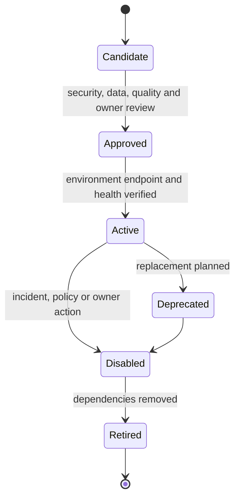

# Agent Forge Model Routing Policy

Status: Draft architecture and harness baseline  
Owner: AI Architect / Runtime Specialist  
Related: #108, #118

## 1. Purpose

Model routing decides which approved model may perform a bounded task under data classification, quality, capacity, latency, and failure constraints.

The repository policy is provider-neutral and authoritative. Environment-specific provider configuration, endpoint URLs, credentials, capacity, and approved internal model IDs are deployment inputs and must not silently change the policy meaning.

Normative assets:

- `harness/schemas/model-routing-policy.schema.json`
- `harness/policies/model-routing.yaml`

## 2. Routing Domains

| Domain | Purpose | Data boundary |
|---|---|---|
| Delivery routing | PM, architecture, implementation, review, and evaluation support for repository work | Only data permitted for the approved delivery provider/environment; no product secrets or production content by default |
| Product routing | Chat generation, embeddings, reranking, classification, and extraction for published Builds | Approved internal closed-network models and applicable product data policy |

Delivery and Product routes do not inherit models, credentials, or approvals from each other.

## 3. Routing Inputs

A route decision evaluates:

- task class;
- delivery or product boundary;
- data classification;
- Agent Version/Build policy;
- approved model status and task eligibility;
- model context/output limits;
- environment availability and capacity;
- latency/error budget;
- deterministic configuration requirements;
- fallback restrictions;
- evaluation/release baseline.

A user or model cannot select an arbitrary provider/model by prompt text.

## 4. Mandatory Principles

1. **Approved models only** — unlisted or inactive model references are denied.
2. **Classification-aware** — a route must explicitly allow the input classification.
3. **No silent external fallback** — failed internal product inference cannot silently use an external service.
4. **Fail closed** — missing route, provider, model, policy, identity, or classification evidence produces failure or safe refusal.
5. **Trace every decision** — policy, route, model, provider, version, attempt, fallback, timing, and outcome are recorded without secrets.
6. **Pin candidate identity** — evaluations and Builds reference exact route-policy versions and model references.
7. **Bound attempts** — retries/fallbacks have small explicit limits and categories.
8. **No quality-driven authorization bypass** — model capability never expands data or Tool access.
9. **Provider configuration is subordinate** — endpoint settings cannot activate an unapproved route.
10. **Human decisions remain human** — model routing does not self-approve release, risk, or Tool actions.

## 5. Route Selection

```text
identify boundary and task
→ validate data classification
→ load active policy version
→ resolve eligible approved models
→ apply Agent/Build and environment constraints
→ select by fixed order or approved capability/capacity strategy
→ execute bounded attempt
→ record route trace
→ apply declared safe failure/fallback behavior
```

### Selection strategies

| Strategy | Meaning | Use |
|---|---|---|
| Fixed | One approved model reference | Default for reproducibility and pilot baselines |
| Ordered failover | Ordered approved references with equivalent policy | Only when failure categories and data restrictions are explicit |
| Capability and capacity | Select among equivalent approved models using a trusted capacity signal | Requires stronger operational and evaluation evidence |

The first pilot should prefer fixed routes until internal endpoints and baselines are stable.

## 6. Failure and Fallback

| Failure | Default product behavior |
|---|---|
| Route not found/inactive | Fail or safe refusal; audit policy failure |
| Classification not allowed | Deny route and safely fail/refuse |
| Model unavailable | Apply only declared retry/fallback; never external silent fallback |
| Rate limited | Bounded retry only when idempotent and within latency budget |
| Timeout | Stop current attempt; use declared alternative only if approved and traced |
| Invalid model output | Validate schema; one bounded regeneration/repair only if policy permits |
| All attempts exhausted | Safe refusal or failure according to task, with correlation ID |
| Embedding/reranker failure | Index/eval job fails or uses an explicitly approved no-reranker baseline; no hidden model substitution |

Cross-provider fallback requires explicit approval and remains inside the allowed classification/network boundary.

## 7. Route Trace

Required fields include:

- Run/Eval/Index Job correlation;
- policy ID and version;
- route ID and task;
- selected model reference, provider, model ID/version;
- Agent Version/Build where applicable;
- input classification;
- attempt and fallback origin;
- start/end and latency;
- outcome and normalized error category;
- token/size usage where allowed;
- safe refusal/failure reason code.

Prohibited fields include credentials, raw tokens, secret headers, and unrestricted classified payloads.

## 8. Model Lifecycle



Rules:

- Model ID/version or material behavior changes require a new model reference or explicit compatibility decision.
- Active is environment-specific.
- Emergency disable blocks new route decisions immediately.
- Builds/evidence retain historical model references.

## 9. Policy Change Process

A routing-policy change requires:

1. problem and requirement IDs;
2. affected tasks, classifications, Builds, environments, and model references;
3. before/after routing behavior;
4. security/data review;
5. quality, latency, capacity, and failure evidence;
6. regression comparison using fixed corpus/config;
7. rollback/disable plan;
8. ADR when provider, trust boundary, failure semantics, or authoritative route behavior changes;
9. policy version increment and audit event;
10. Release Governor review for pilot/release baseline changes.

## 10. Pilot Decisions Still Required

The policy intentionally contains placeholders, not invented approvals. Pilot activation remains blocked until accountable owners decide:

- internal chat LLM ID/version/endpoint and support owner;
- internal embedding model, dimensions, migration behavior, capacity, and owner;
- reranker or approved no-reranker baseline;
- Config-C retrieval/rerank/evaluation baseline;
- allowed classifications and internal model data policy;
- capacity, p95 latency, timeout, concurrency, and incident behavior;
- credentials/secret source and network allowlist;
- model update/deprecation procedure.

## 11. Conformance Tests

Routing validation must cover:

- unlisted/inactive model denial;
- disallowed classification denial;
- task mismatch;
- missing route/provider/model;
- approved fixed route;
- bounded transient retry;
- fallback trace and policy equivalence;
- external fallback prohibition;
- schema-invalid output;
- timeout and exhausted behavior;
- route-policy version in Run/Eval trace;
- secret/redaction checks;
- emergency disable;
- evaluation reproducibility against pinned policy/model references.