# Agent Forge Core State Machines

Status: Draft architecture baseline  
Owner: Product Architect / Backend Architect  
Related: #108, #112

## 1. Purpose

This document defines the allowed lifecycle transitions for the domain objects whose state affects security, reproducibility, retrieval, tool execution, or release decisions.

State names are logical. Existing code/database values may differ, but implementation must map to the same transition meaning or record an ADR for a deliberate change.

## 2. Common Transition Rules

Every protected transition must define:

- current state and requested target state;
- actor/Principal and required permission;
- invariant and precondition checks;
- optimistic lock or equivalent concurrency protection;
- resulting immutable references or version changes;
- Audit Event type and correlation;
- failure code and whether retry is safe;
- evidence required for later release or investigation.

General rules:

1. Terminal historical states are not rewritten.
2. Published or executed immutable configurations are replaced by new versions, not edited in place.
3. Retrying asynchronous work creates a new attempt or preserves attempt history.
4. Security disable/revoke transitions may bypass normal progression but must be authorized and audited.
5. Missing authorization, missing evidence, or stale version follows fail-closed behavior.

## 3. Agent Version Lifecycle

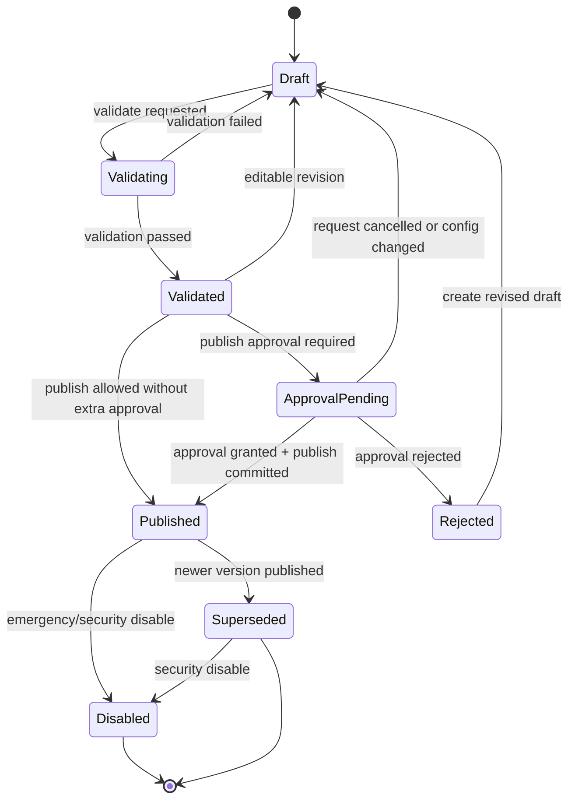

### 3.1 States

| State | Meaning | Editable |
|---|---|---:|
| Draft | Work-in-progress configuration | Yes |
| Validating | Validation execution is in progress | No, or validation is cancelled before edit |
| Validated | Structural/reference/eval preconditions passed for the exact revision | Yes, but any edit returns it to Draft and invalidates validation |
| ApprovalPending | An immutable publish proposal is waiting for accountable decision | No |
| Published | Approved version available for the defined environment/audience | No |
| Superseded | Previously published version replaced by a newer publication | No |
| Rejected | Approval denied for the immutable proposal | No; create/revise Draft |
| Disabled | Execution blocked due to security, compliance, operational, or owner decision | No |

### 3.2 Required guards

| Transition | Required guards |
|---|---|
| Draft → Validating | Schema revision is saved; required owner exists |
| Validating → Validated | References resolve; knowledge/index policy valid; required build-time eval passes; no blocker findings |
| Validated → ApprovalPending | Exact revision/build proposal pinned; approver policy resolved |
| Validated/ApprovalPending → Published | Authorization, approval where required, atomic current-version update, Audit Event |
| Published → Superseded | New version publish succeeds in the same transaction or coordinated commit |
| Any executable state → Disabled | Authorized emergency/security action with reason and incident/reference |

Invalid transitions:

- Draft directly to Published.
- Published back to Draft or Validated.
- Editing an ApprovalPending or Published revision.
- Publishing with stale validation or changed referenced policy/index/model/tool.
- Re-enabling Disabled by mutating the same version without a reviewed decision; prefer a new version or explicit restore ADR.

## 4. Build Lifecycle

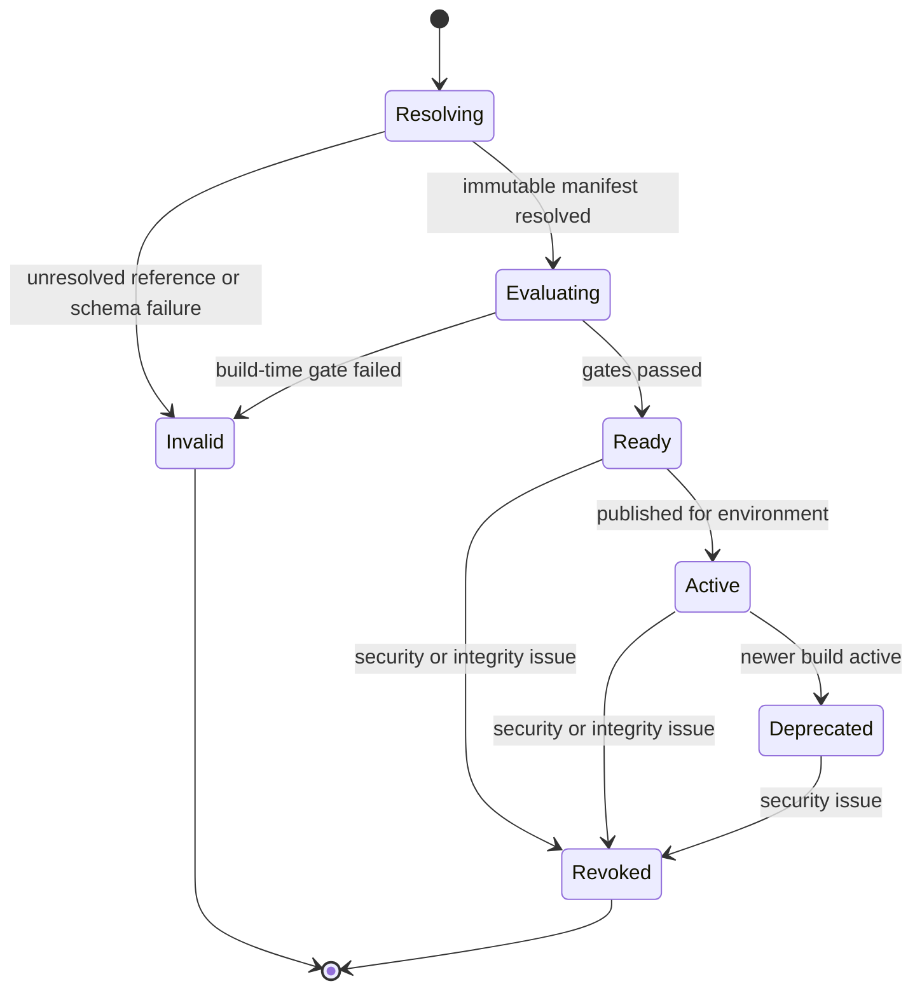

Rules:

- Build identity never changes after Resolving completes.
- Active status is environment/audience-specific deployment metadata, not mutation of build contents.
- Revoked Builds cannot start new Runs.
- Existing Run and audit history retains the revoked Build reference.

## 5. Knowledge Source Lifecycle

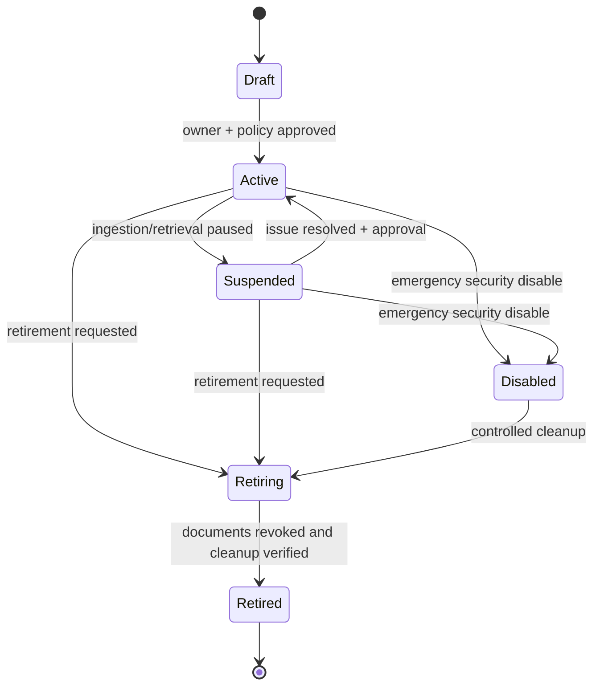

Rules:

- Draft sources cannot feed published Builds.
- Suspended blocks new indexing and may block retrieval according to incident policy.
- Retiring must enumerate dependent Builds/Documents and define replacement or disable behavior.
- Retired source metadata and required audit history remain according to retention policy.

## 6. Document Lifecycle

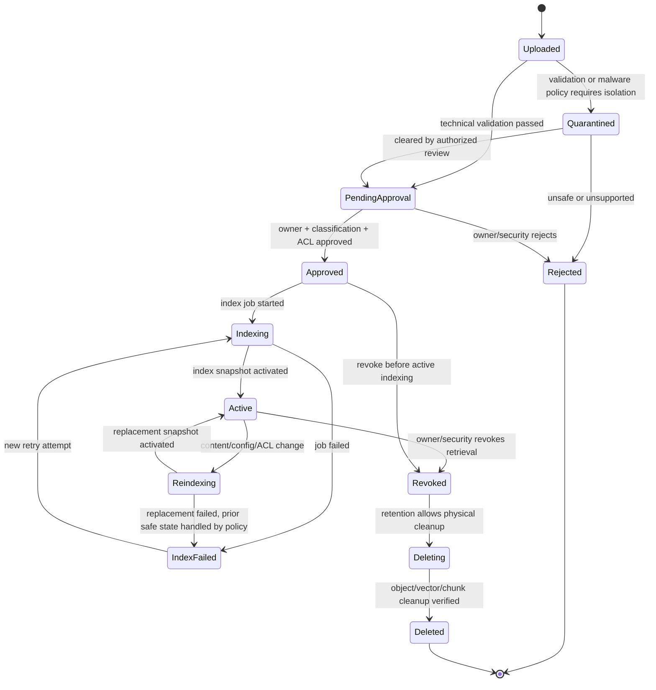

### 6.1 State meaning

| State | Retrieval allowed | Notes |
|---|---:|---|
| Uploaded | No | Raw object received, not trusted |
| Quarantined | No | Isolated for policy/security review |
| PendingApproval | No | Technical validation passed; owner/security approval missing |
| Approved | No | Authorized for indexing but no active searchable snapshot yet |
| Indexing / Reindexing | Policy dependent; normally only prior active snapshot remains usable | New materialization in progress |
| Active | Yes, subject to ACL and Build/source scope | Current valid indexed version |
| IndexFailed | No new snapshot; prior active version only if explicitly safe and unchanged | Failure evidence retained |
| Revoked | No | Retrieval must stop before asynchronous cleanup |
| Deleting | No | Physical and derived cleanup in progress |
| Deleted | No | Minimal audit tombstone may remain |
| Rejected | No | Never approved for use |

Required guards:

- PendingApproval → Approved requires owner, classification, ACL, retention, checksum, and accepted type.
- Approved/Active → Indexing/Reindexing creates a distinct Index Job.
- Indexing → Active requires chunk/vector counts, ACL materialization, checksum lineage, and snapshot activation.
- Active → Revoked invalidates retrieval caches and blocks vector results before cleanup completes.
- Deleting → Deleted requires reconciliation evidence across metadata, object, chunk, vector, and cache stores.

## 7. Index Job Lifecycle

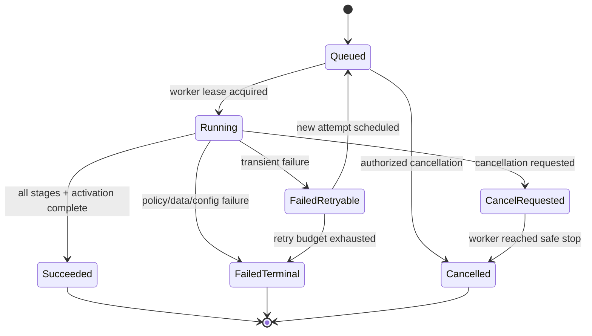

Expected stage progression:

```text
validate_object
→ parse
→ normalize
→ chunk
→ materialize_acl
→ embed
→ vector_upsert
→ reconcile
→ activate_snapshot
→ audit_finalize
```

Rules:

- Stage progress is monotonic within one attempt.
- Worker lease expiration does not silently mark success; reconciliation determines retry.
- A retry preserves the prior attempt error and creates a new attempt number.
- `Succeeded` means activation and required audit evidence completed, not merely vector upsert.
- Partial writes are isolated by generation/snapshot identity until activation.

## 8. Index Snapshot Lifecycle

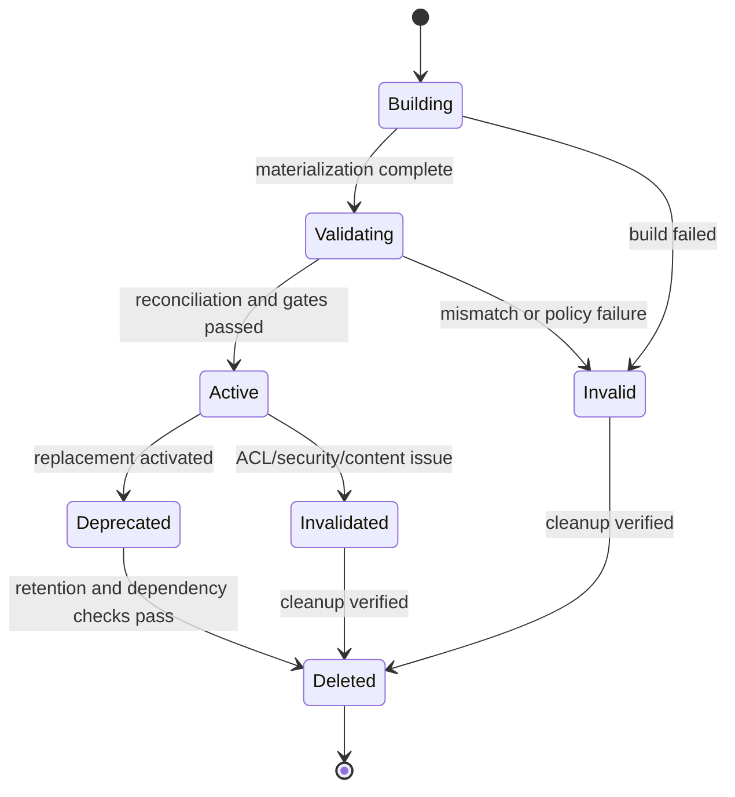

Rules:

- Builds cannot pin Building, Validating, Invalid, or Deleted snapshots.
- Deprecated may remain usable only for already-published Builds if policy allows and no security invalidation exists.
- Invalidated immediately blocks new Runs and may disable dependent Builds.

## 9. Run Lifecycle

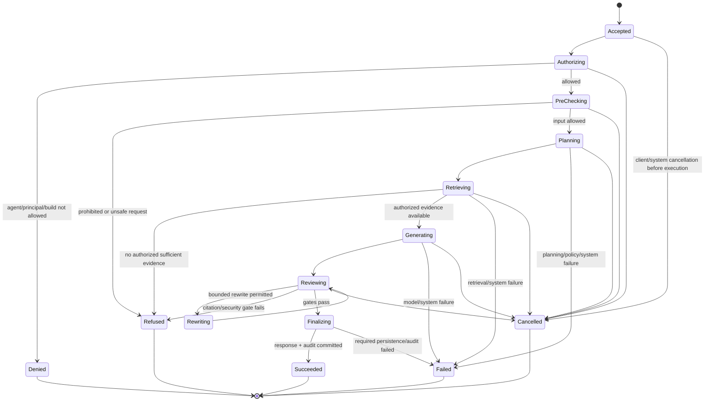

### 9.1 Terminal outcomes

| Outcome | Meaning | User-visible response |
|---|---|---|
| Succeeded | Authorized, grounded response passed final gates and required evidence persisted | Answer with citations |
| Refused | Request was allowed to reach runtime but policy/evidence prevented answering | Safe refusal with bounded reason |
| Denied | Principal is not authorized for Agent/action/resource | Access-denied response without leaking resource existence/details |
| Failed | Technical or required evidence/persistence failure | Generic safe error and correlation ID |
| Cancelled | Execution stopped before terminal answer | Cancellation response/status |

Rules:

- A Run pins Principal context reference, Build, policy versions, and expected Index Snapshot before model execution.
- Unauthorized content must not appear in Retrieval Hits, reranker input, model context, answer, ordinary logs, or UI traces.
- Rewrite/critic loops follow the configured Loop Budget; default at most one answer rewrite in the current product baseline.
- Final success requires response persistence and required audit/trace finalization.
- Failure does not overwrite completed Run Steps.

## 10. Tool Invocation Lifecycle

The first pilot excludes consequential product write tools, but the lifecycle is defined for later governed use.

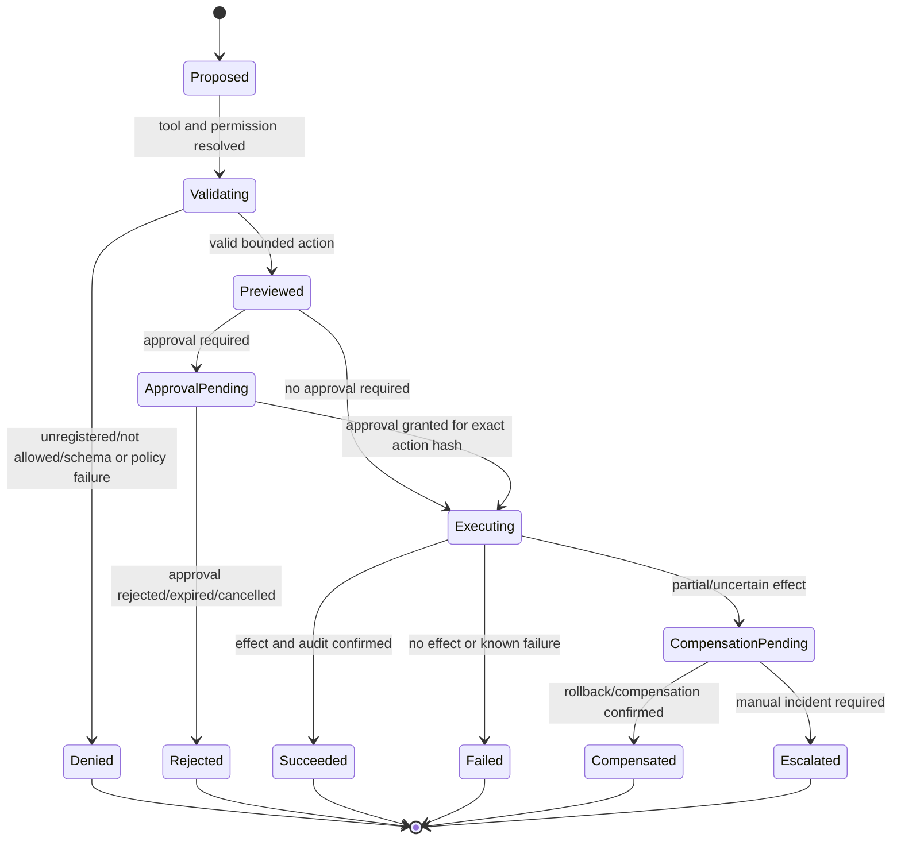

Rules:

- Approval binds to Tool Version, target, normalized parameters, effect preview, Principal/Agent context, and expiration.
- Parameter changes after approval create a new request.
- Automatic retry is allowed only when idempotency and failure semantics prove it safe.
- Unknown execution outcome is not marked Failed-with-no-effect; it becomes CompensationPending or Escalated.

## 11. Approval Lifecycle

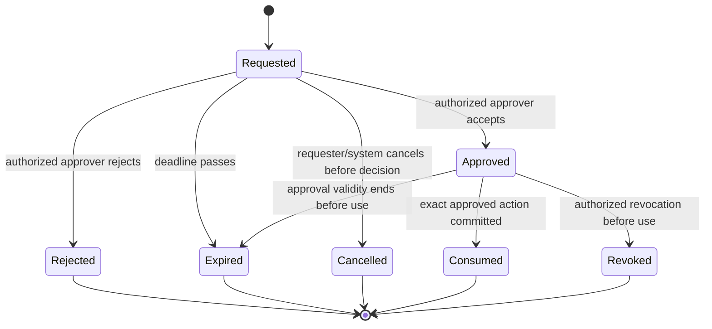

Rules:

- One Approval Request has one terminal decision path.
- Approver identity and separation-of-duties policy are checked at decision time.
- Approval is not reusable unless explicitly designed as a bounded standing permission with its own ADR and controls.
- Consumed links to the exact publish/tool/release action.

## 12. Eval Run Lifecycle

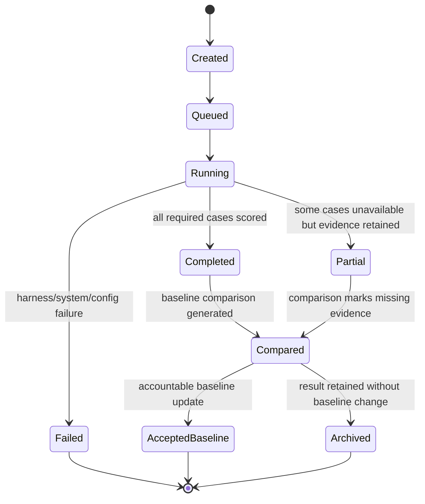

Rules:

- Corpus, Build, configuration, environment, model, and Index Snapshot references are immutable for one Eval Run.
- Missing required blocker cases prevents a release GO, even if aggregate scores appear good.
- Baseline update is an accountable decision, not automatic replacement by the latest run.

## 13. Release Decision Lifecycle

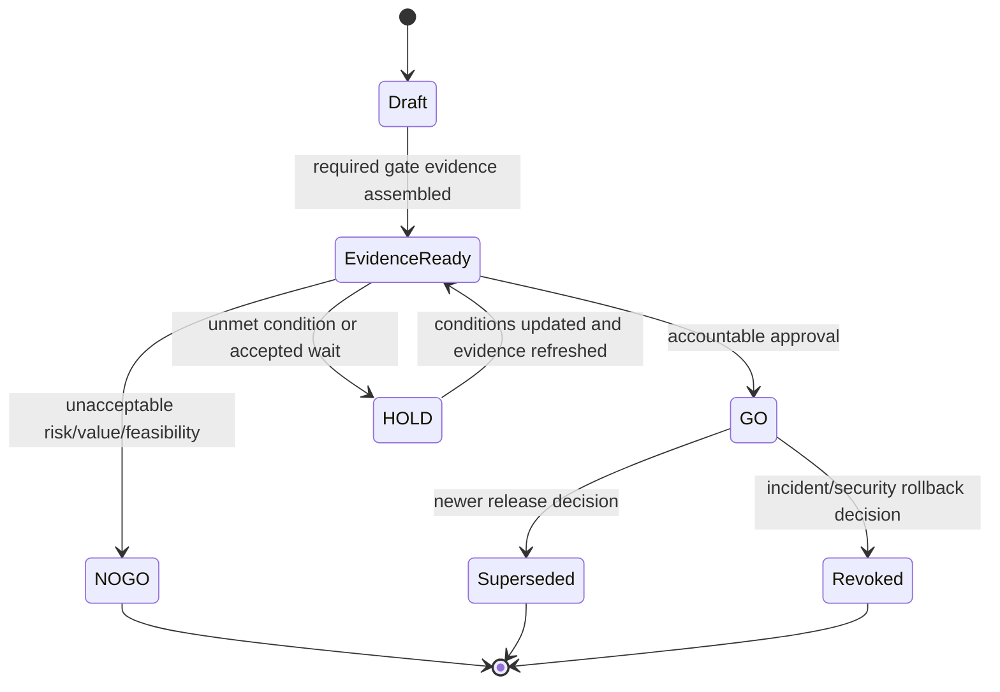

Required guards for GO:

- candidate Build/release identity pinned;
- all mandatory Release Gates present and passing;
- blocker findings resolved or decision explicitly prohibits GO;
- limitations and accepted risks documented;
- target environment and operational owner identified;
- accountable business, product, security, platform, and release decision roles satisfied as applicable.

## 14. Audit Requirements by Transition

| Domain | Transitions requiring Audit Event |
|---|---|
| Agent Version / Build | validate result, approval request/decision, publish, supersede, disable/revoke |
| Knowledge | source activation/suspension, document approval/rejection/revoke/delete, ACL change, snapshot activation/invalidation |
| Runtime | deny/refuse policy decisions, tool proposal/approval/execution, security mask/block, terminal Run outcome summary |
| Tool | register/version/permission change, disable, approval lifecycle, execution and compensation |
| Evaluation | corpus/baseline change, run completion, blocker regression, accepted baseline |
| Release | GO/HOLD/NO-GO, revoke, supersede |
| Administration | model route, policy, retention, system-setting, role/permission changes |

Audit Events include actor, action, target, before/after or version references, outcome, reason, timestamp, request/Run correlation, and classification-aware redaction.

## 15. Concurrency and Idempotency Requirements

- Publish uses an atomic uniqueness rule or transaction so only the intended current version is published.
- Index Job worker leases and attempts prevent duplicate activation.
- Snapshot activation is compare-and-set against expected source/document/config revision.
- Run creation accepts an optional idempotency key only for duplicate ingress protection; it does not merge completed histories silently.
- Tool actions declare idempotency behavior before retries are allowed.
- Approval consumption is atomic and single-use unless a separate standing-permission model is approved.
- Eval baseline acceptance uses expected-current-baseline protection.

## 16. Implementation Conformance

For each stateful API or worker change, the design and tests must cover:

1. allowed transition;
2. invalid transition;
3. stale/concurrent transition;
4. authorization failure;
5. required Audit Event;
6. idempotent retry or explicit non-retry behavior;
7. partial failure and reconciliation;
8. retention of prior evidence;
9. terminal state and user-safe error contract;
10. traceability from requirement to state-machine rule.