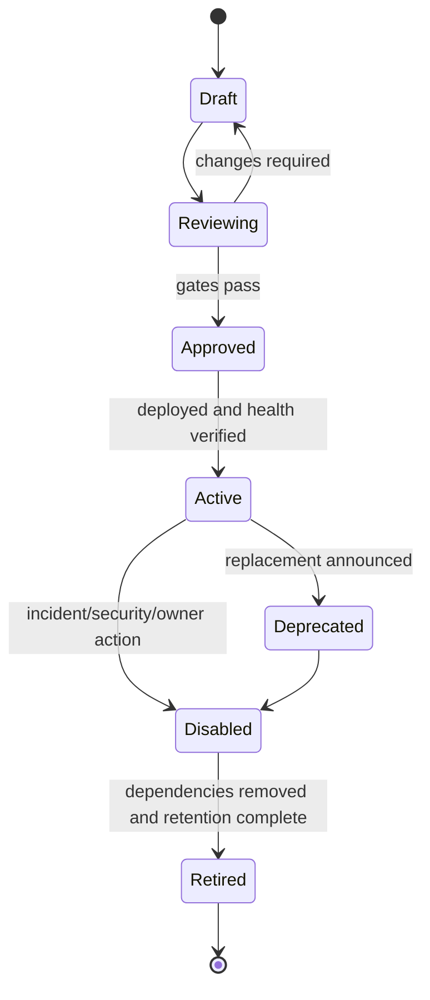

# Agent Forge Tool and MCP Governance

Status: Draft governance baseline  
Owner: Security & Trust Architect / Runtime-MCP Specialist  
Related: #108, #114

## 1. Scope

This document governs every callable capability exposed to either:

- the **Delivery Plane**, where PM/specialist agents use development tools to inspect or change project resources; or
- the **Product Runtime**, where a published Agent may call an approved Tool on behalf of an authenticated Principal.

These are separate trust boundaries. A server, command, credential, or capability approved for development is not automatically approved for product runtime use.

## 2. Registry Separation

| Registry | Purpose | Typical actors | Credentials | Allowed effect boundary |
|---|---|---|---|---|
| Development MCP Registry | Govern repository, issue, PR, CI, documentation, and development-environment actions | PM Orchestrator and Specialist Agents | Developer/service credentials scoped to project resources | Development resources only; protected/destructive actions require explicit rules |
| Product Tool Registry | Govern runtime capabilities available to published Agent Builds | Authenticated end users through Runtime and Tool Executor | Product service/delegated identities | Only contract-defined targets and effects |

Mandatory separation:

1. Separate registry files and approval owners.
2. Separate credentials and secret paths.
3. Separate network allowlists and runtime clients.
4. Separate audit event types and retention policy.
5. Separate onboarding, versioning, disable, and incident processes.
6. No implicit inheritance from developer workstation, model session, or provider configuration.

## 3. Definitions

- **Tool**: stable governed capability identity.
- **Tool Version**: immutable callable contract and implementation reference.
- **MCP Server**: a server that exposes MCP resources, prompts, or tools.
- **Development MCP**: MCP used within the Delivery Plane.
- **Product MCP**: MCP approved for Product Runtime under the Product Tool Registry.
- **Side Effect**: any external change beyond returning data.
- **Consequential Action**: an action affecting business data, messages, workflow, money, access, infrastructure, or external systems.

## 4. Product Tool Admission Gates

A Product Tool Version is not executable until all gates pass:

| Gate | Required evidence |
|---|---|
| Business value | Named use case, accountable domain owner, approved users/Agents |
| Contract | Versioned input/output JSON Schemas, purpose, implementation/server reference, schema hashes |
| Data governance | Input/output classification, retention, redaction, transfer destinations |
| Authorization | Principal/delegation model, roles/groups, Agent/Build allowlist, target allowlist |
| Risk | Read/write/external-transfer declaration, severity, failure impact, abuse cases |
| Execution | Timeout, retry, concurrency, rate limits, circuit breaking, result verification |
| Side-effect safety | Preview/dry run, approval, idempotency, bounded target, rollback/compensation |
| Audit | Requester, Agent/Build, tool/version, normalized action hash, target, result/effect, approval and correlation |
| Security | Threat model, secret handling, network path, dependency/provenance controls |
| Quality | Contract tests, permission tests, failure tests, duplicate/replay tests, load limits |
| Operations | Owner, SLO/support, disable procedure, incident/runbook, dependency health |
| Release | Security and Release Governor decision; registry activation |

## 5. First-Pilot Policy

The first pilot allows only the governed document-RAG runtime. Consequential product write tools are excluded.

Permitted future design work does not grant runtime permission. The following remain inactive unless separately approved after the pilot boundary changes:

- ERP/manufacturing changes;
- database writes;
- email sending or calendar creation;
- groupware/approval transitions;
- file-server writes;
- source-control changes;
- purchasing, HR, finance, access-control, infrastructure, or production operations.

Read-only Tools may also be deferred unless they are required by an approved pilot use case and pass all applicable admission gates.

## 6. Risk Classes

| Risk | Typical capability | Default treatment |
|---|---|---|
| R0 — Pure/local | Deterministic transformation with no sensitive data or external call | Registry and schema still required; no human approval normally |
| R1 — Read internal | Read bounded internal resource with Principal authorization | ACL/target allowlist, timeout, redaction, audit |
| R2 — Sensitive read/export | Read confidential data or transfer across a boundary | Explicit data policy, stronger approval/role checks, destination control |
| R3 — Reversible write | Create/update with reliable idempotency and rollback | Preview, exact-action approval where required, effect verification, rollback test |
| R4 — Consequential/irreversible | Financial, access, production, legal, external message, destructive action | Human approval mandatory, separation of duties, narrow target, compensation/incident plan; may remain prohibited |

The stricter risk applies when a Tool has multiple modes.

## 7. Tool Contract Requirements

The normative schema is `harness/schemas/tool-contract.schema.json`.

Every Product Tool Version defines:

- schema and contract version;
- stable `tool_id` and immutable `version`;
- owner and support contacts/roles;
- purpose and approved use cases;
- protocol/server/implementation reference;
- input and output schemas with hashes;
- data classification and retention;
- read/write/external-transfer side effects;
- risk class;
- allowed Agent/Build and Principal populations;
- target allowlists and denied targets;
- approval, preview, and action-hash rules;
- idempotency and duplicate handling;
- timeout, retry, rate, concurrency, and circuit-breaker policy;
- audit fields and redaction;
- secret and network requirements;
- failure categories and user-safe errors;
- rollback or compensation behavior;
- status, deprecation, disable, and incident ownership;
- required tests and release evidence.

Unknown, omitted, or ambiguous side effects are treated as consequential and blocked.

## 8. MCP-Specific Rules

MCP is a protocol, not an authorization model. Agent Forge applies the same Tool Contract and Product Tool Registry rules to MCP-exposed tools.

### 8.1 MCP capability types

| Capability | Product treatment |
|---|---|
| Resources | Treat as data sources with ownership, classification, authorization, freshness, and citation rules |
| Prompts | Treat as versioned executable instructions; no silent modification of Agent/policy prompts |
| Tools | Treat as Product Tool Versions with full contract and side-effect governance |

### 8.2 Server onboarding

An MCP Server record includes:

- server ID, owner, environment, version/provenance;
- transport and network destination;
- authentication method and secret reference;
- exposed capability allowlist;
- trust/data classifications;
- health and timeout expectations;
- logging/audit behavior;
- disable/revoke procedure;
- compatibility and schema-pinning policy.

Dynamic server discovery does not grant execution. Capability changes require review before activation.

### 8.3 Human-in-the-loop

Human approval is required for R4 and normally for R3 actions unless an ADR establishes a narrower approved rule. The interface must show:

- Tool and version;
- requester Principal and Agent/Build;
- normalized target;
- material parameters with redaction;
- expected effect and risk;
- action hash and expiry;
- rollback/compensation statement;
- approve/reject controls.

Approval is single-use for the exact action hash unless an explicitly governed standing permission exists.

## 9. Execution Policy

```text
resolve active Tool Version
→ authorize Principal + Agent/Build + target
→ validate schema and classification
→ compute normalized action and idempotency key
→ produce preview when required
→ obtain/verify approval for exact action
→ reserve idempotency record
→ execute with timeout and bounded credentials
→ verify effect/result
→ write audit/trace
→ return normalized result
```

Rules:

- No model-generated raw command, SQL, URL, path, or target bypasses the contract validator.
- The Tool Executor uses least-privilege product credentials, never developer credentials.
- Automatic retry requires known safe semantics.
- Timeout with unknown outcome becomes `uncertain_effect`, not a blind retry.
- Required audit failure prevents success acknowledgement.
- Tool output is untrusted input to the model and is size/schema/content checked.

## 10. Failure, Rollback, and Compensation

| Outcome | Required behavior |
|---|---|
| Validation/authorization denial | No external call; safe denial and audit |
| Known no-effect failure | Normalized failure; retry only under declared policy |
| Known successful effect | Effect verification and audit before success response |
| Partial effect | Enter compensation workflow; do not report ordinary success/failure |
| Unknown effect | Stop retries, query outcome if safe, escalate to human/incident owner |
| Rollback succeeds | Record original and rollback effects with correlations |
| Rollback unavailable/fails | Escalate with affected target, owner, evidence, and containment action |

## 11. Development MCP Governance

Development MCP supports delivery work, but it also needs contracts.

Minimum controls:

- versioned entry in `harness/registries/development-mcp.yaml`;
- purpose and owner;
- allowed specialist roles;
- resource scope and protected targets;
- read/write/destructive classification;
- approval requirement;
- secret source and prohibition on secret output;
- audit location;
- branch/environment restrictions;
- disable and incident procedure.

Default delivery rules:

1. Work occurs on a feature branch, not direct `main` mutation.
2. Destructive filesystem, repository, production, or account actions require explicit authorization.
3. PR merge occurs only after required evidence and CI.
4. Parallel agents do not share mutable workspaces unless isolation is proven.
5. Development MCP cannot reach Product Runtime or production data by default.
6. Tool results never override the Work Order's approved scope.

## 12. Registry Lifecycle



- Active is environment-specific and references immutable contract/version.
- Schema or implementation behavior changes create a new version.
- Emergency disable is authorized and audited and blocks new calls immediately.
- Existing audit/Run history retains the original Tool Version reference.

## 13. Testing Matrix

Every Tool Version is tested for:

- valid and invalid schema;
- unauthorized Principal, Agent, Build, and target;
- data-classification route restrictions;
- timeout and dependency failure;
- output schema and malicious/untrusted output;
- approval absent, rejected, expired, changed parameters, and replay;
- idempotent duplicate requests;
- partial and unknown outcome;
- rollback/compensation where declared;
- audit and redaction;
- disable/deprecation behavior;
- concurrency/rate limits;
- no development credential or registry leakage.

## 14. Change and ADR Triggers

A full ADR and security review are required when:

- introducing Product MCP or the first Tool in a new risk/domain class;
- allowing a side effect or external transfer;
- changing approval, idempotency, rollback, audit, or credential model;
- allowing dynamic tool/server discovery;
- sharing credentials/registries between delivery and runtime;
- allowing model-generated targets beyond an explicit allowlist;
- creating standing permissions;
- weakening fail-closed behavior;
- moving a Tool into the first-pilot scope.