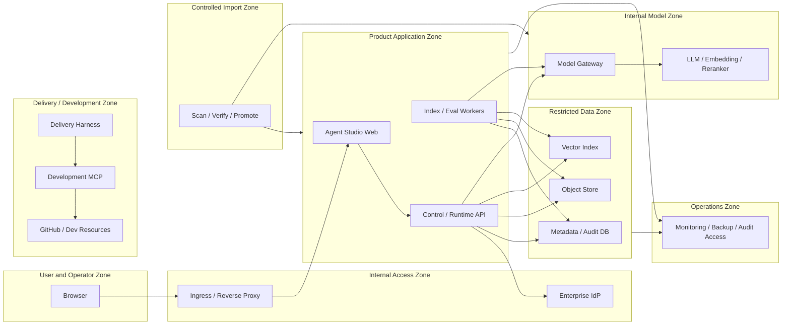
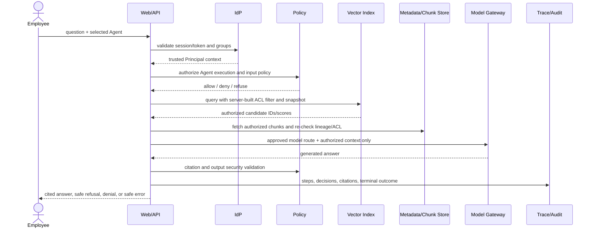
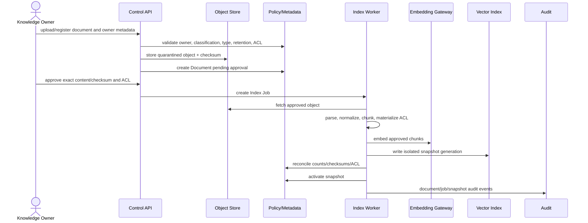
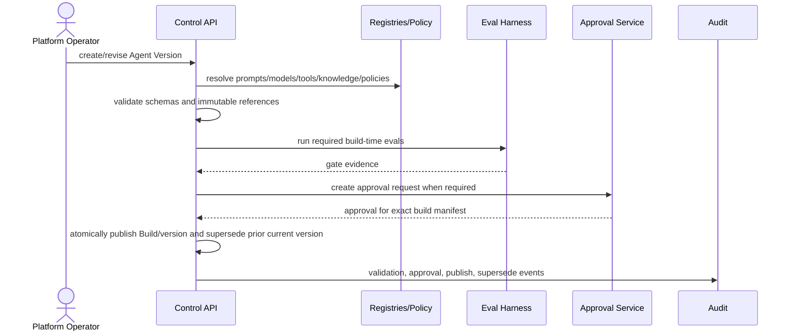

# Agent Forge Trust Boundaries and Data Flows

Status: Draft security baseline  
Owner: Security & Trust Architect  
Related: #108, #114

## 1. Purpose

This document identifies where identity, privilege, data classification, policy authority, and operational ownership change. It defines the minimum controls and fail-closed behavior for the product's principal data flows.

It complements the C4 baseline. A network connection alone is not a trust decision; every boundary requires authenticated identity, authorization, validation, classification-aware logging, and accountable ownership.

## 2. Trust Zones



## 3. Boundary Register

| ID | Boundary | Trust change | Required controls | Fail-closed behavior |
|---|---|---|---|---|
| TB-01 | Browser → Ingress/Web/API | Untrusted client input enters product | TLS, request limits, CSRF/session policy, input schema, trusted authentication flow, correlation ID | Reject request without revealing internal details |
| TB-02 | API → Enterprise IdP | Local request becomes trusted Principal/group context | Approved protocol, issuer/audience validation, token/session expiry, group claim rules, clock tolerance, revocation/failure handling | Deny protected action when identity cannot be verified |
| TB-03 | API/Worker → PostgreSQL | Application principal accesses authoritative metadata/audit | Service identity, least privilege, migrations, transaction rules, encryption, query parameterization, audit access controls | No fallback to client-provided policy or cached stale authority |
| TB-04 | API/Worker → Object Store | Metadata authority accesses classified binaries | Service credentials, bucket/prefix policy, checksum, encryption, owner/classification metadata, signed bounded access if used | Deny object access; never substitute file-system visibility for authorization |
| TB-05 | API/Worker → Vector Index | Derived search store receives queries and ACL filters | Server-built ACL filter, collection/tenant isolation, schema/version validation, no raw secret storage, reconciliation | Refuse retrieval if ACL filter or index generation cannot be trusted |
| TB-06 | Model Gateway → Internal Models | Authorized context crosses into model-serving responsibility | Approved route, model/data-class rules, payload limits, timeout, no outbound relay, trace metadata, redaction | Refuse/fail safely; no silent external-provider fallback |
| TB-07 | Product → Operations | Runtime metadata becomes logs/metrics/backups | Classification-aware logging, secret/content redaction, restricted audit access, retention, integrity, backup encryption | Continue only when required evidence can be retained; required audit failure blocks success |
| TB-08 | Controlled Import → Product/Model | External artifacts enter closed network | source approval, malware/license/vulnerability scan, signatures/hashes, SBOM/provenance, internal mirror, promotion record | Artifact remains quarantined and undeployable |
| TB-09 | Delivery Harness → Development MCP | Specialist agent gains development actions | versioned registry, scoped credentials, explicit side effects, branch protection, human approval for destructive actions, audit | Block unregistered or over-privileged tool use |
| TB-10 | Delivery Zone → Product Runtime | Development capability could be confused with product capability | separate credentials, registries, networks, schemas, approval authorities, deployment process | No automatic exposure; explicit Product Tool onboarding required |
| TB-11 | Product Tool Executor → Enterprise System | Future runtime action crosses domain ownership and may cause effects | Product Tool Contract, target allowlist, Principal delegation, preview, approval, idempotency, timeout, audit, compensation | Deny unknown/unapproved action; uncertain effect escalates rather than retries blindly |

## 4. Data Classification Handling

Each payload or stored artifact is assigned the stricter applicable classification from source policy, user request, and generated content.

| Data type | Examples | Minimum treatment |
|---|---|---|
| Public/internal metadata | Agent name, non-sensitive status | authenticated access according to role; normal operational logging allowed |
| Internal business content | ordinary approved documents and answers | ACL-filtered access; internal model routes; bounded trace excerpts |
| Confidential/restricted content | policies, designs, personnel/security material | explicit owner approval, stricter model/tool routes, redacted logs, limited audit viewers, retention controls |
| Identity/security data | subject IDs, groups, policy decisions, credentials | credentials never logged; minimum identity persistence; restricted audit access |
| Secrets | tokens, passwords, private keys, connection strings | secret manager/mount only; never prompts, traces, documents, schemas, commits, or tool output |
| Derived embeddings/index metadata | embeddings, chunk IDs, ACL payload | treated according to source classification; vector access never considered harmless by default |

## 5. Query and Answer Flow



Required controls:

1. Client identity fields are not authoritative.
2. Agent Version/Build, policy versions, and expected Index Snapshot are pinned.
3. ACL is included in vector/lexical query, then chunk access and citation are revalidated.
4. Reranker and model see only authorized content.
5. No-context, stale snapshot, policy uncertainty, or required audit failure produces refusal/failure rather than improvisation.
6. Trace stores references and redacted evidence, not unrestricted prompt/document dumps.

## 6. Document Ingestion Flow



Controls:

- Unapproved or quarantined documents never enter an active index.
- Parser output is untrusted and subject to size, type, content, and prompt-injection-aware handling.
- Partial vector writes remain isolated until reconciliation and activation.
- Revocation blocks retrieval before asynchronous physical deletion.
- ACL changes rematerialize or invalidate derived index/cache state.

## 7. Agent Validation, Build, and Publish Flow



Controls:

- Validation becomes stale when any referenced content changes.
- Approval binds to an immutable Build manifest/hash.
- Publish is atomic and authorized; published content is immutable.
- A Build referencing invalidated knowledge, model, policy, or Tool Version is blocked or disabled according to policy.

## 8. Evaluation and Release Flow

1. The Eval Run pins corpus, Build, environment, models, policies, and Index Snapshot.
2. Test Principals and allowed/forbidden evidence are explicit.
3. Runtime Runs execute through the same protected path or an explicitly equivalent isolated path.
4. Results retain deterministic scores, failure attribution, and links to safe trace evidence.
5. Missing blocker cases or incomplete evidence prevents GO.
6. Baseline acceptance and release GO/HOLD/NO-GO require accountable human decisions.
7. Evaluation fixtures never receive unauthorized production content merely to improve realism.

## 9. Future Product Tool Flow

Consequential write tools are outside the first pilot. A future approved flow is:

```text
Intent and tool permission check
→ Tool Contract/version resolution
→ input schema and target allowlist validation
→ side-effect preview and action hash
→ approval request when required
→ approval for exact action hash
→ idempotency reservation
→ execution with bounded timeout
→ result/effect verification
→ audit and response
→ compensation or human escalation for partial/unknown outcome
```

Prohibited behavior:

- silent parameter changes after approval;
- retries without known idempotency/failure semantics;
- use of developer credentials or developer MCP servers;
- broad environment access instead of bounded targets;
- reporting success without effect verification and required audit;
- hiding unknown/partial effects as simple failures.

## 10. Threat and Control Matrix

| Threat | Example | Preventive controls | Detective/recovery controls |
|---|---|---|---|
| Identity spoofing | client supplies privileged user/group headers | trusted IdP integration, server-side claims, signed tokens/sessions | authentication audit, anomaly alerts, session revocation |
| ACL leakage | forbidden chunks retrieved or logged | authorization-before-relevance, query filters, chunk re-check, deny default | leakage eval gates, trace review, snapshot invalidation |
| Stale ACL/index | group or document permission changes but vector payload remains | versioned ACL materialization, invalidation/reindex, snapshot pinning | reconciliation jobs, access regression tests |
| Prompt injection | document instructs model to bypass policy | treat documents as data, bounded prompts/tools, security checks, no secrets in context | injection eval cases, refusal/trace review |
| Citation spoofing | answer cites unrelated authorized document | citation locator lineage, claim support validation, deterministic gates | citation eval and auditor drill-down |
| Sensitive log leakage | prompts/documents/tokens written to logs | structured allowlist logging, redaction, separate audit, secret scanning | log access review, retention cleanup, incident response |
| Model route exfiltration | silent fallback to external provider | approved route allowlist, no outbound internet, fail closed | route trace, egress monitoring, config audit |
| MCP confused deputy | development tool executes product action with broad credentials | separate registries/credentials, exact contract, target allowlist, approval | tool audit, branch/environment protection, incident disable |
| Schema drift | server/tool accepts unexpected fields or behavior | versioned JSON Schema and hash, compatibility checks | contract tests, registry disable/deprecation |
| Approval replay | old approval reused for changed action | exact action hash, expiration, one-time consumption | approval audit and reconciliation |
| Duplicate side effect | timeout causes blind retry | idempotency key, outcome query, bounded retry policy | compensation workflow, human escalation |
| Supply-chain compromise | imported package/model altered | approved source, scan, signature/hash, SBOM, internal mirror | provenance audit, rapid revoke/rollback |

## 11. Logging and Evidence Rules

- General logs contain correlation IDs, categories, timings, and bounded metadata; not full classified payloads by default.
- Audit Events contain actor, action, target/version, outcome, reason, and references with classification-aware redaction.
- Runtime traces preserve enough evidence to reconstruct decisions while minimizing sensitive content.
- Credentials, raw tokens, secret headers, private keys, and connection strings are never retained.
- Tool previews and approvals may store hashes and redacted fields; full values only where approved and necessary.
- Retention differs for document content, runtime traces, audit, evaluation, and operations; the stricter policy applies.

## 12. Security Review Triggers

A new or updated security design is mandatory when a change:

- introduces a new Principal type, identity provider, or delegation model;
- changes ACL semantics or moves authorization after retrieval;
- introduces a model/provider/network path;
- changes storage authority, retention, backup, or deletion behavior;
- adds Product MCP, a Tool, external transfer, or side effect;
- reuses delivery credentials, agents, hooks, or MCP in product runtime;
- adds a service/trust zone or removes a fail-closed control;
- changes audit, redaction, approval, idempotency, or compensation semantics.