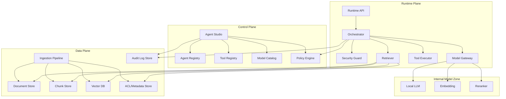
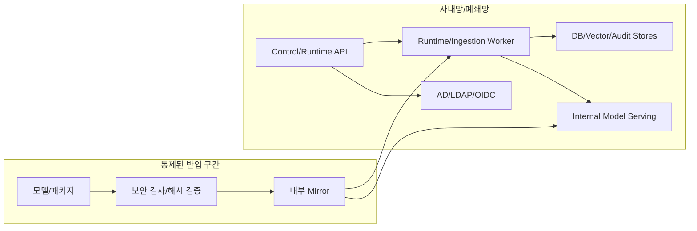

# Agent Forge Architecture

## 개요

Agent Forge는 사내망/폐쇄망에서 운영되는 통제형 Agent Builder이다. MVP는 사내 문서 기반 RAG 에이전트 빌더로 제한한다. 핵심 검증 대상은 문서 ingestion, ACL-aware retrieval, 근거 기반 답변, 에이전트 설정, 실행/감사 로그이다.

전체 설계는 Control Plane, Runtime Plane, Data Plane으로 분리한다.

## Control Plane

Control Plane은 에이전트와 정책의 생성, 변경, 배포를 담당한다.

| 구성 요소 | 책임 | MVP |
|---|---|---|
| Agent Studio | 에이전트 카드, 문서 범위, 프롬프트, 모델 선택 UI | 포함 |
| Agent Registry | 에이전트 정의, 버전, 소유자, 배포 상태 | 포함 |
| Tool Registry | 허용 도구, 스키마, 위험 등급 | 읽기/검색 도구 중심 |
| Model Catalog | Local LLM, embedding, reranker 목록과 사용 조건 | 포함 |
| Policy Engine | 에이전트 실행, 문서 ACL, 도구 호출 정책 판정 | 포함 |
| Config Store | 정책/에이전트/모델 설정 저장 | 포함 |

Control Plane의 주요 불변 조건은 다음과 같다.

- 승인된 에이전트 버전만 Runtime Plane에서 실행된다.
- Tool Registry에 없는 도구는 호출할 수 없다.
- 정책, 모델, 도구, 문서 범위 변경은 감사 로그에 기록한다.
- 외부 SaaS 기반 모델/도구는 MVP에서 사용하지 않는다.

## Runtime Plane

Runtime Plane은 사용자 요청을 받아 실제 실행을 수행한다.

| 구성 요소 | 책임 |
|---|---|
| Runtime API | 사용자 요청 수신, 인증 컨텍스트 확인, request_id 발급 |
| Orchestrator | 실행 계획, 검색, 모델 호출, 응답 조립 |
| Security Guard | prompt injection, 민감정보, 출력 정책 점검 |
| Retriever | ACL-aware retrieval, rerank, citation 구성 |
| Tool Executor | 등록된 도구 호출, schema validation, 결과 정규화 |
| Model Gateway | 내부 LLM/embedding/reranker 호출 추상화 |

실행 흐름은 다음 기준을 따른다.

1. 사용자를 인증하고 에이전트 실행 권한을 확인한다.
2. 입력을 Security Guard로 점검한다.
3. 문서 검색 전 ACL filter를 적용한다.
4. 검색 후 chunk/citation 단위로 ACL을 재검증한다.
5. 내부 Model Gateway를 통해 답변을 생성한다.
6. 출력 정책, PII masking, citation 유효성을 점검한다.
7. 실행 결과와 정책 판정을 감사 로그로 남긴다.

## Data Plane

Data Plane은 문서, chunk, vector, ACL, 감사 로그를 관리한다.

| 저장소 | 저장 대상 | MVP 보안 기준 |
|---|---|---|
| Document Store | 원본 문서, URI, 해시, 버전 | 등급별 접근 제한 |
| Chunk Store | chunk 텍스트, source pointer, hash | 문서 ACL 상속 |
| Vector DB | embedding, chunk id, 검색 metadata | 원문 전체 미저장 |
| ACL/Metadata Store | 부서, 사용자/그룹, 문서 등급, 보존 기간 | deny-by-default |
| Audit Log Store | 실행, 정책 판정, 관리자 변경 이벤트 | append-only |

ACL이 없거나 소유자가 불명확한 문서는 색인하지 않는다. 문서 권한이 변경되면 chunk, vector index, cache를 함께 무효화한다.

## 폐쇄망 배포 기준

폐쇄망 기본 전제는 outbound internet 차단이다. 모델, 패키지, parser, 취약점 DB는 통제된 반입 절차와 해시 검증 후 내부 mirror에 등록한다. 운영 로그와 감사 로그는 외부 SaaS로 전송하지 않는다.

## MVP와 이후 확장 경계

| 영역 | MVP 포함 | MVP 제외 | 이후 확장 조건 |
|---|---|---|---|
| 문서 RAG | ingestion, ACL 검색, citation 답변 | 기밀 문서 자동 색인 | 등급별 승인/보존 정책 |
| 에이전트 설정 | 에이전트 카드, 모델 선택, 문서 scope | 자율 multi-agent 실행 | 평가/승인 checkpoint |
| 도구 | 검색/조회성 도구 | 쓰기 작업, 외부 전송 | Tool Registry, Policy Engine, Audit 필수 |
| DB | 정적 추출 데이터 검색 | 운영 DB 직접 질의/수정 | read-only replica, SQL allowlist |
| ERP | 없음 | 전표/발주/인사 변경 | dry-run, human approval, rollback |
| 그룹웨어 | 없음 | 메일 발송, 일정 생성, 결재 자동화 | 초안 모드와 사용자 최종 확인 |
| 외부망 | 없음 | 외부 LLM/API/SaaS | 별도 보안 심의와 망연계 통제 |

## 확장 원칙

DB/ERP/그룹웨어 연동은 Runtime Plane 내부에 임의 구현으로 추가하지 않는다. 모든 확장은 Tool Pack으로 도입하며, Tool Registry에 스키마, 소유자, 위험 등급, 허용 에이전트, 허용 사용자 범위를 등록해야 한다. 쓰기 또는 외부 전송이 있는 도구는 human approval과 강화된 감사 로그를 요구한다.

상세 설계 노트: `notes/02_Architecture/전체 아키텍처 v0.1.md`

