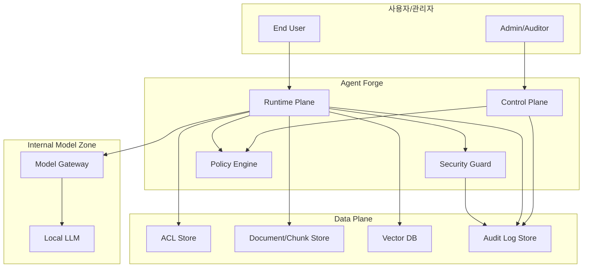
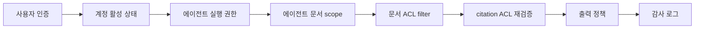

# Agent Forge Security Model

## 개요

Agent Forge 보안 모델은 폐쇄망 환경에서 문서 기반 RAG 에이전트를 안전하게 운영하기 위한 기준이다. MVP 보안 목표는 권한 없는 문서 노출 방지, prompt injection 방어, 민감정보 출력 통제, 감사 가능성 확보이다.

기본 원칙은 다음과 같다.

- deny-by-default
- least privilege
- 모든 실행의 감사 가능성
- 외부 SaaS와 외부 LLM API 미사용
- 원문 로그 최소 저장
- Tool Registry 기반 도구 allowlist

## 폐쇄망 보안 아키텍처

외부 인터넷 호출은 기본 차단한다. 모델, 패키지, 보안 업데이트는 통제된 반입 절차를 통해 내부 mirror에 등록한다. 인증은 AD/LDAP/OIDC 중 조직 표준을 사용하되, Agent Forge 내부에서는 Identity Provider 추상화로 취급한다.

## ACL Matrix 요약

| 리소스/행위 | Platform Admin | Security Auditor | Agent Owner | Knowledge Manager | End User |
|---|---|---|---|---|---|
| 에이전트 생성/수정 | 가능 | 불가 | 소유 범위 가능 | 불가 | 불가 |
| 에이전트 배포 | 가능 또는 승인 실행 | 불가 | 승인 요청 | 불가 | 불가 |
| 문서 등록 | 설정 가능 | 조회 | 연결 요청 | 가능 | 불가 |
| 문서 ACL 변경 | 정책 관리 | 조회 | 요청 | 메타데이터 수정 | 불가 |
| 문서 검색 | 테스트 가능 | 제한적 재현 | 소유 에이전트 테스트 | 검수 가능 | 허용 에이전트만 |
| 감사 로그 조회 | 제한적 | 가능 | 소유 범위 일부 | ingestion 일부 | 불가 |
| 감사 로그 수정/삭제 | 불가 | 불가 | 불가 | 불가 | 불가 |

문서 등급은 공개, 내부, 제한, 기밀로 나눈다. MVP는 공개/내부/제한 문서를 대상으로 하며, 기밀 문서는 기본 색인 대상에서 제외한다.

## 권한 판정 순서

권한 회수, 퇴사, 부서 이동, 문서 ACL 변경이 발생하면 관련 cache와 vector metadata를 무효화해야 한다.

## Threat Model 요약

| 위협 | 시나리오 | MVP 대응 |
|---|---|---|
| 권한 없는 문서 노출 | 타부서 문서 chunk가 검색 결과에 포함 | 검색 전 ACL filter, 응답 전 ACL 재검증 |
| Prompt injection | 문서 내 악성 지시가 모델 행동을 변경 | 문서는 데이터로 취급, Security Guard, tool allowlist |
| 민감정보 출력 | 개인정보/기밀 내용이 답변에 포함 | PII 탐지, masking, 기밀 문서 제외 |
| 로그 과다 저장 | 질의/응답 원문이 장기 저장 | hash/metadata/summary 중심 저장 |
| 도구 오남용 | 모델이 미등록 도구 또는 쓰기 작업을 호출 | Tool Registry allowlist, MVP read-only |
| 공급망 오염 | 외부 반입 모델/패키지에 악성 코드 포함 | 반입 승인, 해시 검증, 내부 mirror |
| 서비스 거부 | 대량 요청/대형 문서로 모델 또는 ingestion 과부하 | rate limit, timeout, queue limit |

## 감사 로그 정책

감사 로그는 일반 운영 로그와 분리한다. 모든 실행은 request_id를 가지며, 사용자, 에이전트, 정책, 문서, 도구 이벤트를 상관관계로 추적할 수 있어야 한다.

| 이벤트 | 예시 | 필수 |
|---|---|---|
| 인증/인가 | login.failure, policy.denied, acl.filtered | 필수 |
| 에이전트 변경 | agent.created, agent.updated, agent.published | 필수 |
| 문서 처리 | document.ingested, document.rejected, acl.synced | 필수 |
| 실행 | request.accepted, request.completed, request.failed | 필수 |
| 검색 | retrieval.completed, citation.selected | 필수 |
| 가드레일 | prompt_injection.detected, pii.masked, output.blocked | 필수 |
| 도구 | tool.requested, tool.allowed, tool.denied | MVP 읽기 도구 필수 |
| 관리자 변경 | policy.changed, model.changed, role.changed | 필수 |
| 감사 조회 | audit_log.viewed, audit_export.created | 필수 |

원문 저장 기본값은 저장하지 않음이다. 사용자 질의, 모델 응답, 검색 chunk, 도구 입출력은 hash, metadata, summary를 우선 저장한다. 사고 조사나 품질 평가로 원문이 필요할 때는 승인, masking, 제한 보존 기간을 적용한다.

## MVP 보안 기준

- ACL 없는 문서는 색인하지 않는다.
- Runtime Plane에서 외부 인터넷 호출을 허용하지 않는다.
- Local LLM은 Model Gateway를 통해서만 호출한다.
- Tool Executor는 MVP에서 읽기/검색 도구만 활성화한다.
- 기밀 문서는 기본 색인 대상에서 제외한다.
- 감사 로그는 append-only이며, 수정/삭제 권한을 운영 관리자에게 부여하지 않는다.
- prompt injection, PII masking, citation 검증, ACL 우회 테스트는 출시 전 필수 보안 테스트에 포함한다.

## 이후 확장 보안 조건

| 확장 영역 | 주요 위험 | 필수 조건 |
|---|---|---|
| DB | 과다 조회, SQL injection, 권한 없는 row/column 접근 | read-only replica, SQL allowlist, masking, query audit |
| ERP | 금전/인사/구매 트랜잭션 오작동 | dry-run, human approval, SoD, rollback, transaction audit |
| 그룹웨어 | 메일 오발송, 결재 오작동, 외부 유출 | 초안 모드, 수신자 검증, 사용자 최종 확인 |
| 외부망 | 데이터 외부 전송과 외부 로그 잔류 | 망연계 심의, 데이터 분류, 전송 승인 |
| 자율 multi-agent | 연쇄 실행과 통제 손실 | step budget, tool budget, 승인 checkpoint, kill switch |

상세 노트:

- `notes/05_Security/권한 ACL Matrix.md`
- `notes/05_Security/Threat Model v0.1.md`
- `notes/05_Security/감사 로그 정책.md`

