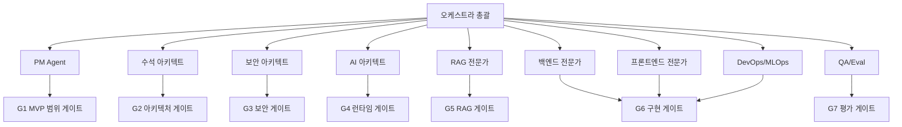

# 오케스트라 실행계획

## 목적

오케스트라 실행계획은 여러 전문가 산출물을 하나의 프로젝트 흐름으로 묶기 위한 운영 문서다. Agent Forge는 단순 개발 과제가 아니라 사내망 AI 에이전트 제작/운영 체계이므로, 각 전문가의 판단이 서로 충돌하지 않도록 게이트와 통합 기준을 둔다.

## 1차 실행 목표

`Agent Forge를 설명 가능한 프로젝트 패키지로 만든다.`

이 목표가 끝났다는 의미는 다음 문서가 존재하고 서로 모순되지 않는다는 뜻이다.

- 프로젝트 제안서
- MVP 유스케이스 정의서
- 전체 아키텍처
- 보안 모델
- Agent Build Spec
- RAG 설계
- 구현 계획
- 평가 계획

## 오케스트라 운영 흐름

## Phase 0. 설명 가능 상태

| 작업 | 담당 | 완료 기준 |
|---|---|---|
| 프로젝트 제안서 작성 | PM Agent | 1페이지 설명과 기대효과가 있다 |
| MVP 유스케이스 확정 | PM Agent | 사용자, 입력, 출력, 성공 기준이 있다 |
| 비범위 확정 | 오케스트라 총괄 | ERP 쓰기/메일/결재 자동화가 제외됨 |
| 의사결정 로그 작성 | 오케스트라 총괄 | 이름, MVP, 운영 구조가 ADR로 남음 |

## Phase 1. 설계 고정

| 작업 | 담당 | 완료 기준 |
|---|---|---|
| 전체 아키텍처 v0.2 | 수석 아키텍트 | Plane별 책임과 서비스 경계가 있다 |
| 보안 모델 v0.2 | 보안 아키텍트 | ACL, Audit, PII, Prompt Injection 대응이 있다 |
| Agent Build Spec | AI 아키텍트 | 스키마, workflow, quality gate가 있다 |
| RAG 설계 | RAG 전문가 | ingestion부터 citation까지 연결됨 |

## Phase 2. 구현 착수 준비

| 작업 | 담당 | 완료 기준 |
|---|---|---|
| API/DB 설계 | 백엔드 전문가 | MVP endpoint와 table 목록이 있다 |
| Agent Studio 화면 | 프론트엔드 전문가 | Builder/Test/Trace/Admin 흐름이 있다 |
| 폐쇄망 배포 계획 | DevOps/MLOps | 모델/패키지/이미지 반입 방법이 있다 |
| 평가 계획 | QA/Eval | eval case 유형과 통과 기준이 있다 |

## 오케스트라가 관리할 리스크

| 리스크 | 신호 | 대응 |
|---|---|---|
| 범위 확장 | ERP/그룹웨어 자동화 요구가 MVP에 섞임 | Tool Pack 후속으로 이동 |
| 보안 후순위화 | 검색부터 만들고 ACL을 나중에 붙이자는 제안 | ACL filter 선행 원칙 고정 |
| 모델 중심 사고 | LLM 성능 이야기만 커짐 | Agent Builder/권한/감사 중심으로 재정렬 |
| 문서 품질 부족 | 샘플 문서가 적거나 메타데이터가 없음 | 파일럿 부서 문서 50~200개 확보 |
| 설명 불가능 | 구성요소는 많은데 한 줄 설명이 안 됨 | 제안서와 스크립트로 압축 |

## 다음 액션

- [ ] 전문가별 산출물을 수합한다.
- [ ] 문서 간 용어를 Agent Forge, Agent Builder, Agent Build로 통일한다.
- [ ] `notes/` 초안을 `docs/` 공식 산출물로 승격한다.
- [ ] 첫 번째 구현 후보 backlog를 만든다.
