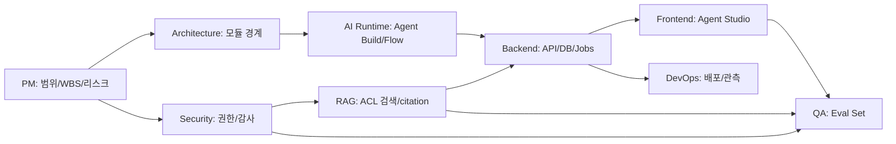

# 전문가 디스패치 보드

## 현재 목표

Agent Forge를 설명 가능한 프로젝트로 만들고, 1차 MVP 범위를 사내 문서 기반 RAG 에이전트 빌더로 고정한다.

## 현재 스프린트 목표

이번 스프린트의 1차 목표는 `프로젝트 설명 가능 상태`를 만드는 것이고, 다음 목표는 Sprint 0 착수 준비다. 각 전문가 산출물은 최종적으로 프로젝트 제안서, MVP 유스케이스 정의서, 파일럿 준비, 오케스트라-에이전트 운영 모델, 딥 전문 에이전트 점검, 아키텍처, 보안 모델, Agent Build Spec, RAG 설계, 구현 계획, 구현 착수 Backlog, 평가 계획으로 승격되어야 한다.

## 전문가별 현재 과제

| 전문가 | 현재 과제 | 산출물 | 상태 |
|---|---|---|---|
| 오케스트라 총괄 | 전체 범위와 순서 통제 | 디스패치 보드, 의사결정 로그 | 진행중 |
| 오케스트라 총괄 | 전문 에이전트 deep work 기준 정의 | [[notes/00_Orchestrator/오케스트라-에이전트 운영 모델|오케스트라-에이전트 운영 모델]] | 초안 |
| 오케스트라 총괄 | 분야별 D2/D3 깊이 점검 | [[notes/00_Orchestrator/딥 전문 에이전트 점검 리포트|딥 전문 에이전트 점검 리포트]] | 완료 |
| PM Agent | WBS, 일정, 리스크 정리 | [[notes/01_PM/WBS|WBS]] | 초안 |
| PM Agent | 파일럿 부서/문서/권한 준비 | [[notes/01_PM/파일럿 준비 체크리스트|파일럿 준비 체크리스트]] | 초안 |
| 수석 아키텍트 | Control/Runtime/Data Plane 설계 | [[notes/02_Architecture/전체 아키텍처 v0.1|전체 아키텍처 v0.1]] | 초안 |
| AI 아키텍트 | Agent Build 정의와 Runtime 흐름 | [[notes/03_AI_Runtime/에이전트 빌드 정의|에이전트 빌드 정의]] | 초안 |
| 보안 아키텍트 | ACL, 감사, 정보유출 통제 | [[notes/05_Security/권한 ACL Matrix|권한 ACL Matrix]] | 초안 |
| RAG 전문가 | 문서 수집/검색/근거 답변 | [[notes/04_RAG_Data/문서 파이프라인 설계|문서 파이프라인 설계]] | 초안 |
| 백엔드 전문가 | API/DB/서비스 경계 | [[notes/06_Backend/API 초안|API 초안]] | 초안 |
| 프론트엔드 전문가 | Agent Studio 화면 흐름 | [[notes/07_Frontend/Agent Studio 화면 설계|Agent Studio 화면 설계]] | 초안 |
| DevOps/MLOps | 폐쇄망 모델/배포/관측 | [[notes/08_DevOps_MLOps/폐쇄망 배포 구상|폐쇄망 배포 구상]] | 초안 |
| QA/Eval | 성공 기준과 테스트 질문 | [[notes/09_QA_Eval/MVP 평가 기준|MVP 평가 기준]] | 초안 |
| 구현 전문가 | Sprint 0~2 착수 Backlog | [[notes/01_PM/구현 착수 Backlog|구현 착수 Backlog]] | 초안 |

## 산출물 연결 맵

## 디스패치 완료 기준

| 전문가 | 완료 기준 |
|---|---|
| 오케스트라 총괄 | 총괄/전문 에이전트 책임, deep work 단계, 승격 기준이 있다 |
| PM Agent | 제안서, 유스케이스, 8~12주 WBS, 리스크 로그가 있다 |
| 수석 아키텍트 | Control/Runtime/Data Plane과 MVP 배포 단위가 있다 |
| 보안 아키텍트 | ACL Matrix, Threat Model, Audit Policy가 있다 |
| AI 아키텍트 | Agent Build Schema와 Runtime Flow가 있다 |
| RAG 전문가 | 문서 파이프라인, chunking, retrieval, citation 정책이 있다 |
| 백엔드 전문가 | API, DB, job, audit 저장 구조가 있다 |
| 프론트엔드 전문가 | Agent Studio MVP 화면과 사용자 흐름이 있다 |
| DevOps/MLOps | 폐쇄망 배포, 모델 서빙, 모니터링 구상이 있다 |
| QA/Eval | 성공 기준, 테스트 유형, 회귀 평가 흐름이 있다 |

## 딥 점검 결과

| 분야 | 현재 깊이 | 오케스트라 판정 | 다음 지시 |
|---|---:|---|---|
| PM | D2 일부 | 파일럿 실명/소유자 공백이 남아 있음 | stakeholder map과 document owner 확정 |
| 아키텍처 | D2 | 설계 깊이는 충분 | 배포 검증과 service fitness test 필요 |
| 보안 | D2 | ACL/감사 설계는 깊음 | deterministic ACL test 필요 |
| RAG/Data | D2 강함 | pipeline과 citation 설계는 깊음 | synthetic corpus와 parser smoke 필요 |
| AI Runtime | D2 강함 | Agent Build 계약은 깊음 | schema/runtime state validator 필요 |
| Backend | D2 + D3 시작 | Sprint 0 skeleton으로 검증 시작 | CRUD/contract/integration test 필요 |
| Frontend | D2 | 화면 설계는 깊음 | 실제 workflow와 Playwright 필요 |
| DevOps/MLOps | D2 | 폐쇄망 운영 설계는 깊음 | compose boot smoke와 offline manifest 필요 |
| QA/Eval | D2 | release gate와 scorer 설계는 깊음 | eval case schema와 runner 필요 |

## 현재 디스패치 진행

| 디스패치 | 담당 전문가 | 상태 | 증거 |
|---|---|---|---|
| Sprint 0 metadata API contract test | Backend + QA | 확장 | create/detail/update/version validate/publish |
| Synthetic corpus v0.1 | RAG + Security + QA | 시작 | `eval/synthetic-corpus/cases-v0.1.json` |
| Synthetic corpus deterministic scorer | QA + RAG + Security | 시작 | `eval/harness/run_synthetic_eval.py` |
| Fake retrieval ACL test | RAG + Security + QA | 시작 | `eval/harness/tests/test_fake_retrieval.py` |
| Compose smoke | DevOps/MLOps | 검증 | full boot 통과 |
| Agent Studio route smoke | Frontend + QA | 검증 | Playwright 7/7 통과 |
| Pilot owner closure | PM | 대기 | 파일럿 부서/문서 소유자 미확정 |

## 다음 회의에서 확인할 질문

- Agent Forge는 실제로 Craft AI를 도입하는 프로젝트인가, Craft AI 개념을 참고해 내부 플랫폼을 만드는 프로젝트인가?
- 사내망에서 사용 가능한 LLM, GPU, 스토리지, DB 제약은 무엇인가?
- 1차 문서 범위는 어느 부서와 어떤 문서군으로 할 것인가?
- Sprint 0은 synthetic corpus와 dummy ACL로 바로 시작해도 되는가?
- 사용자/부서/직급/문서등급 중 어떤 권한 축을 MVP에 반드시 넣을 것인가?
- MVP 성공 기준은 정확도, 권한위반 0건, 응답속도, citation 비율 중 무엇을 우선할 것인가?

## 오케스트라가 지금 내린 임시 결정

- Craft AI는 비교 기준과 참고 개념으로 두고, 프로젝트 정의는 `사내망용 Agent Builder`로 둔다.
- 첫 구현은 문서 RAG 중심이며, DB/ERP/그룹웨어는 Tool Pack 확장으로 분리한다.
- MVP는 기능보다 통제 가능성을 먼저 증명한다.
- 오케스트라는 총괄과 게이트를 맡고, 전문 에이전트는 기본 D2 deep specialist 수준으로 산출물을 만든다.
- D2 설계 깊이와 D3 검증 증거를 분리해서 관리한다. 지금은 대부분 D2 통과, D3 착수 상태다.
