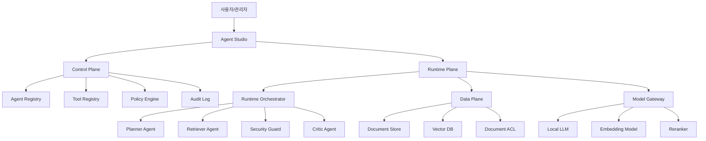

# 전체 아키텍처 v0.1

## 구조

## Control Plane

에이전트 생성, 버전 관리, 도구 등록, 권한 정책, 감사 정책을 관리한다.

## Runtime Plane

사용자 요청을 받아 계획, 검색, 답변 생성, 검토, 보안 점검, 로그 저장을 실행한다.

## Data Plane

문서, chunk, vector index, ACL, 원본 파일 메타데이터를 관리한다.

