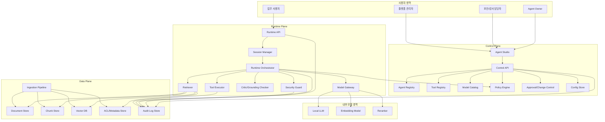
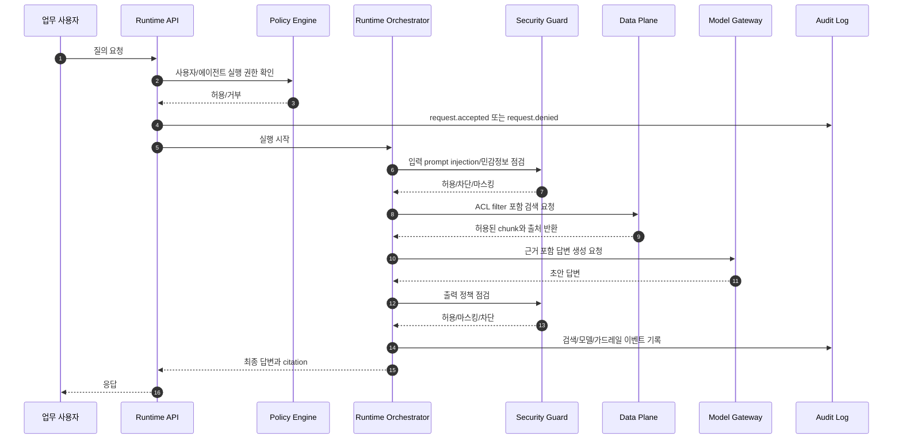
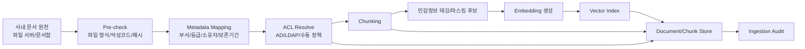
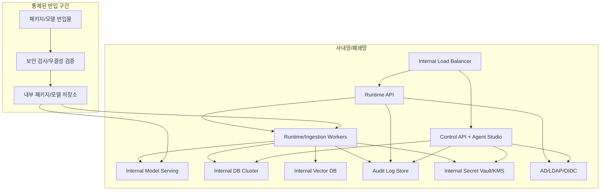

# 전체 아키텍처 v0.1

## 목적

Agent Forge는 사내망/폐쇄망에서 동작하는 통제형 Agent Builder이다. 1차 MVP는 사내 문서 기반 RAG 에이전트 빌더로 제한하며, DB/ERP/그룹웨어 자동화는 이후 Tool Pack 확장으로 분리한다.

핵심 설계 원칙은 다음과 같다.

- Control Plane, Runtime Plane, Data Plane을 명확히 분리한다.
- 모든 실행은 인증, 권한, 정책, 감사 로그를 통과한다.
- 외부 SaaS, 외부 LLM API, 외부 벡터 DB에 의존하지 않는다.
- MVP는 읽기/검색/근거 답변을 검증하고, 쓰기 작업은 기본 범위에서 제외한다.
- 이후 확장은 Tool Registry, Policy Engine, Audit Log 계약을 재사용한다.

## 전체 구조

## Control Plane

Control Plane은 에이전트와 정책의 생성, 변경, 배포를 담당한다. 사용자 요청을 직접 처리하지 않고, Runtime Plane이 사용할 승인된 설정과 정책을 제공한다.

### 주요 책임

| 구성 요소 | 책임 | MVP 범위 | 이후 확장 |
|---|---|---|---|
| Agent Studio | 에이전트 카드 생성, 문서 범위 선택, 프롬프트 템플릿, 배포 상태 확인 | 필수 | 테스트 시나리오, 평가 대시보드 |
| Control API | 관리 기능 API, 변경 이력 기록, 정책 검증 호출 | 필수 | 배포 파이프라인 연동 |
| Agent Registry | 에이전트 정의, 버전, 소유자, 활성 상태 관리 | 필수 | 환경별 승격(dev/stage/prod) |
| Tool Registry | 허용 도구 목록, 도구 스키마, 위험 등급 관리 | MVP는 검색/읽기 도구 중심 | DB/ERP/그룹웨어 Tool Pack |
| Model Catalog | 내부 모델, embedding, reranker, 컨텍스트 한도, 사용 가능 등급 관리 | 필수 | 모델별 평가 점수, 비용/성능 정책 |
| Policy Engine | 에이전트 실행 가능 여부, 문서 ACL, 도구 호출 정책 판정 | 필수 | ABAC 조건, 승인 워크플로 |
| Approval/Change Control | 고위험 설정 변경 승인 | 최소 변경 승인 기록 | 다단계 승인 |
| Config Store | 에이전트/정책/모델 설정의 기준 데이터 저장 | 필수 | 형상 관리 시스템 연동 |

### Control Plane 불변 조건

- 에이전트는 승인된 버전만 Runtime Plane에 배포된다.
- Tool Registry에 등록되지 않은 도구는 Runtime Plane에서 호출할 수 없다.
- 정책 변경, 모델 변경, 문서 범위 변경은 감사 로그에 남긴다.
- 권한 없는 사용자는 에이전트 정의, 문서 범위, 시스템 프롬프트를 조회할 수 없다.
- 폐쇄망 환경에서는 모델과 패키지 반입 이력이 관리되어야 한다.

## Runtime Plane

Runtime Plane은 업무 사용자의 질의를 받아 실제 에이전트 실행을 수행한다. 실행 중 매 단계는 Policy Engine과 Audit Log에 연결되어야 한다.

### 주요 책임

| 구성 요소 | 책임 | 보안 통제점 |
|---|---|---|
| Runtime API | 사용자 인증 토큰 수신, 요청 정규화, 요청 ID 발급 | 인증 실패 차단, rate limit |
| Session Manager | 대화 세션, 사용자 컨텍스트, 요청 상관관계 관리 | 세션 만료, 사용자 바인딩 |
| Runtime Orchestrator | 계획 수립, 검색, 모델 호출, 응답 조립 | 실행 단계별 정책 검사 |
| Security Guard | prompt injection 탐지, 민감정보 출력 점검, 정책 위반 차단 | 차단/마스킹/승인 필요 판정 |
| Retriever | ACL-aware retrieval, rerank, 근거 문서 구성 | 검색 전 ACL filter, 검색 후 ACL 재검증 |
| Critic/Grounding Checker | 답변과 근거의 일치성, 출처 누락 검사 | 근거 없는 주장 경고 또는 차단 |
| Tool Executor | 승인된 도구만 호출, 파라미터 검증, 결과 정규화 | MVP는 읽기 전용 도구만 허용 |
| Model Gateway | 내부 LLM/embedding/reranker 호출 추상화 | 외부 모델 호출 차단, 모델별 정책 적용 |

### 실행 흐름

### Runtime Plane 불변 조건

- Runtime Plane은 사용자 권한을 신뢰하지 않고 매 요청마다 Control Plane 정책을 조회하거나 캐시된 서명 정책을 검증한다.
- 검색은 항상 ACL filter를 먼저 적용하고, 응답 직전 citation 단위로 ACL을 재검증한다.
- 모델 입력에는 필요한 최소 컨텍스트만 포함한다.
- 모델 출력은 사용자에게 전달되기 전에 Security Guard를 통과한다.
- 도구 호출은 Tool Registry의 스키마, 위험 등급, 허용 주체, 허용 에이전트 조건을 만족해야 한다.

## Data Plane

Data Plane은 원본 문서, chunk, vector index, ACL, 감사 로그를 관리한다. 데이터 접근은 Runtime Plane과 Control Plane의 서비스 계정을 통해서만 허용한다.

### 주요 책임

| 데이터 저장소 | 저장 대상 | MVP 범위 | 보안 요구 |
|---|---|---|---|
| Document Store | 원본 파일, 원본 URI, 해시, 버전 | 필수 | 등급별 암호화, 원본 접근 제한 |
| Chunk Store | chunk 텍스트, chunk hash, source pointer | 필수 | ACL 상속, 민감정보 태그 |
| Vector DB | embedding vector, chunk id, metadata | 필수 | 원문 미저장 원칙, ACL metadata 필수 |
| ACL/Metadata Store | 문서 소유 부서, 열람 주체, 등급, 보존 기간 | 필수 | deny-by-default, 변경 이력 |
| Audit Log Store | 실행 로그, 정책 판정, 관리자 변경 이력 | 필수 | append-only, 무결성 검증 |
| Config Store | 에이전트/정책/모델 설정 | 필수 | 버전 관리, 승인 이력 |

### Ingestion 흐름

### Data Plane 불변 조건

- ACL이 없거나 소유자가 불명확한 문서는 기본적으로 검색 색인에 포함하지 않는다.
- 문서 등급, 소유 부서, 허용 사용자/그룹, 보존 기간은 색인 metadata에 포함한다.
- Vector DB에는 원문 전체를 저장하지 않고 chunk id와 검색용 metadata만 저장한다.
- 감사 로그는 일반 실행 로그와 분리 저장하고, 관리자도 원문 로그를 임의 수정할 수 없다.
- 문서 삭제 또는 권한 회수 시 vector index, chunk store, cache를 함께 무효화한다.

## 폐쇄망 배포 구성

### 폐쇄망 제약 반영

- 기본 전제는 outbound internet 차단이다.
- 모델, 패키지, 문서 파서는 통제된 반입 절차를 거쳐 내부 mirror에 등록한다.
- 외부 API key가 필요한 SaaS 연동은 MVP에서 제외한다.
- 내부 인증은 AD/LDAP/OIDC 중 하나를 기준으로 하며, MVP 설계에서는 추상화된 Identity Provider로 둔다.
- 내부 CA, 내부 NTP, 내부 DNS를 사용한다.
- 운영 로그와 감사 로그는 외부 분석 SaaS로 전송하지 않는다.
- 취약점 DB, 모델 파일, 패키지 업데이트는 오프라인 반입 이력과 해시 검증을 남긴다.

## MVP 범위와 이후 확장 경계

| 영역 | MVP 포함 | MVP 제외 | 이후 확장 기준 |
|---|---|---|---|
| 문서 RAG | 문서 ingestion, chunking, vector index, ACL-aware retrieval, citation 답변 | 기밀 문서 자동 공개, 개인 드라이브 무차별 색인 | 문서 등급별 승인 정책과 보존 정책 확장 |
| 에이전트 설정 | 에이전트 카드, 문서 범위, 모델 선택, 프롬프트 템플릿, 배포 상태 | 복잡한 multi-agent 자율 실행 | 평가/시뮬레이션 통과 후 단계적 허용 |
| 도구 호출 | 검색/조회성 내부 도구, 상태 확인 도구 | ERP 쓰기, 메일 발송, 결재 승인, DB update/delete | Tool Pack별 위험 등급, human approval, 감사 로그 필수 |
| DB 연동 | 정적 문서 또는 사전 추출 데이터 기반 검색 | 운영 DB 직접 질의/수정 | read-only replica, SQL allowlist, 결과 masking 후 도입 |
| ERP 연동 | 없음 | 전표/발주/인사 변경 등 트랜잭션 | dry-run, 승인, 이중 통제, rollback plan 필요 |
| 그룹웨어 | 없음 | 메일 발송, 일정 생성, 결재 상신/승인 자동화 | 초안 생성부터 시작하고 사용자 확인 후 실행 |
| 외부망 | 없음 | 외부 LLM, 외부 검색, SaaS connector | 별도 보안 심의와 망연계 통제 필요 |

## 확장 아키텍처 원칙

이후 DB/ERP/그룹웨어 확장은 Runtime Plane에 임의 코드를 추가하는 방식이 아니라 Tool Pack으로 도입한다.

Tool Pack은 다음 계약을 만족해야 한다.

- Tool Registry에 스키마, 소유자, 위험 등급, 허용 에이전트, 허용 사용자 범위를 등록한다.
- Policy Engine이 호출 전 허용 여부를 판정할 수 있어야 한다.
- Tool Executor는 입력 파라미터를 스키마 검증하고 secret을 직접 노출하지 않는다.
- 모든 호출은 request_id, actor, agent_id, tool_id, input hash, output summary, decision을 감사 로그에 남긴다.
- 쓰기 또는 외부 전송이 있는 도구는 human approval 또는 이중 통제 정책을 가져야 한다.

