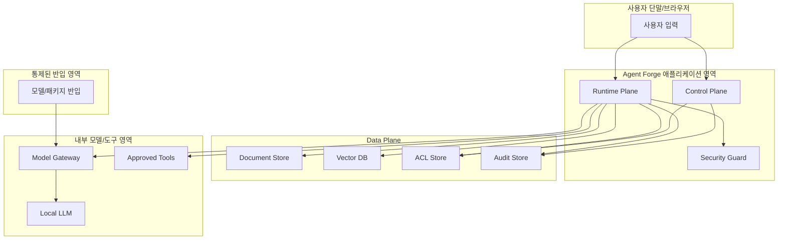

# Threat Model v0.1

## 범위

이 문서는 Agent Forge MVP의 위협 모델을 정의한다. 범위는 사내망/폐쇄망에서 동작하는 문서 기반 RAG 에이전트 빌더이며, DB/ERP/그룹웨어 쓰기 자동화는 MVP 위협 범위에서 제외하되 확장 시 보안 요구를 함께 기술한다.

## 보호 대상

| 자산 | 설명 | 보안 목표 |
|---|---|---|
| 원본 문서 | 사내 문서, 정책, 매뉴얼, 업무 자료 | 기밀성, 무결성, 보존 정책 |
| Chunk/Vector Index | 검색용 chunk와 embedding | 권한 기반 검색, 원문 역추적 통제 |
| 에이전트 정의 | 프롬프트, 문서 scope, 모델, 도구 설정 | 무결성, 변경 추적 |
| 사용자 질의/응답 | 대화 내용, citation, 세션 정보 | 최소 저장, 민감정보 보호 |
| 감사 로그 | 실행 이벤트, 정책 판정, 관리자 변경 | 무결성, 부인 방지 |
| 모델/패키지 아티팩트 | Local LLM, embedding, reranker, parser | 공급망 무결성 |
| Secret | DB 계정, 서비스 계정, API credential | 노출 방지, 회전, 최소 권한 |

## 신뢰 경계

신뢰 경계는 사용자 단말, 애플리케이션 영역, Data Plane, 내부 모델/도구 영역, 통제된 반입 영역으로 나눈다. 경계 간 호출은 인증된 서비스 계정, 네트워크 정책, 감사 로그를 요구한다.

## STRIDE 기반 주요 위협

| 분류 | 위협 | 시나리오 | 영향 | MVP 대응 | 잔여 위험/후속 |
|---|---|---|---|---|---|
| Spoofing | 사용자 사칭 | 탈취된 계정으로 제한 문서 검색 | 기밀 문서 노출 | IAM 연동, 세션 만료, 계정 상태 확인, 감사 로그 | MFA/step-up auth 검토 |
| Spoofing | 서비스 계정 오남용 | ingestion 계정으로 원문 대량 조회 | 대량 유출 | 서비스 계정 범위 제한, 대화형 로그인 금지 | secret rotation 자동화 |
| Tampering | 문서/metadata 변조 | 등급을 낮춰 색인되도록 조작 | 권한 우회 | metadata 변경 이력, Knowledge Manager 권한 제한 | 원천 시스템 서명 검증 |
| Tampering | 에이전트 프롬프트 변조 | 시스템 프롬프트에 우회 지시 삽입 | 정책 무력화 | Agent Registry 버전 관리, 배포 승인 | 프롬프트 diff 리뷰 |
| Repudiation | 실행 부인 | 사용자가 민감 질의를 하지 않았다고 주장 | 조사 불가 | request_id, actor, agent_id, timestamp 기록 | 로그 무결성 서명 |
| Repudiation | 관리자 변경 부인 | 정책 완화 후 변경 사실 부인 | 책임 추적 실패 | 관리자 변경 audit event 필수 | WORM 저장소 검토 |
| Information Disclosure | 권한 없는 문서 노출 | 검색 결과에 타부서 chunk 포함 | 기밀성 침해 | 검색 전 ACL filter, 응답 전 ACL 재검증 | cache key ACL version 적용 |
| Information Disclosure | Prompt injection | 문서 내 악성 지시가 모델 행동 변경 | 정책 우회, 데이터 노출 | 문서 지시 무시 원칙, Security Guard, tool allowlist | 공격 샘플 평가셋 운영 |
| Information Disclosure | 민감정보 출력 | 개인정보/기밀 문장이 답변에 포함 | 개인정보/영업기밀 유출 | PII 탐지, masking, citation 제한 | 도메인별 탐지 규칙 강화 |
| Information Disclosure | 로그 과다 저장 | 질의/응답 원문이 장기 보관 | 2차 유출 | 최소 저장, hash/summary, 원문 보존 제한 | 보존 기간 자동 만료 |
| Denial of Service | 검색/모델 과부하 | 대량 요청으로 모델 서버 지연 | 서비스 장애 | rate limit, timeout, queue limit | 사용자/에이전트별 quota |
| Denial of Service | 대형 문서 ingestion | 비정상 대용량 파일로 index 지연 | 색인 장애 | 파일 크기 제한, 파서 timeout | ingestion 격리 worker |
| Elevation of Privilege | 역할 상승 | End User가 Agent Owner API 호출 | 설정 변조 | API별 RBAC, 서버측 권한 검사 | 권한 테스트 자동화 |
| Elevation of Privilege | 도구 권한 우회 | 모델이 미등록 도구 호출 유도 | 외부 전송/쓰기 실행 | Tool Registry allowlist, Tool Executor 강제 | Tool Pack 보안 심사 |
| Supply Chain | 모델/패키지 오염 | 외부 반입 모델에 악성 코드 포함 | 시스템 장악/정보 유출 | 반입 해시 검증, 보안 검사, 내부 mirror | 서명된 SBOM |

## LLM/RAG 특화 위협

| 위협 | 설명 | 대응 기준 |
|---|---|---|
| Indirect prompt injection | 문서에 포함된 지시문이 시스템 정책보다 우선하도록 유도 | 검색 문서는 데이터로 취급하고 명령으로 실행하지 않는다. Security Guard가 지시문 패턴을 탐지한다. |
| Retrieval poisoning | 악성 또는 부정확 문서를 색인해 답변 품질을 훼손 | ingestion 승인, 문서 소유자, 출처, 해시, 변경 이력을 유지한다. |
| Cross-tenant leakage | 에이전트/부서 간 문서가 섞여 반환 | agent_id, user_id, ACL version을 검색과 캐시에 포함한다. |
| Hallucinated citation | 존재하지 않거나 권한 없는 문서를 근거로 제시 | citation은 Document Store의 source pointer로만 생성하고, 응답 전 ACL을 재검증한다. |
| Sensitive inference | 직접 문서를 보여주지 않아도 여러 답변으로 민감 정보를 추론 | rate limit, 세션별 질의 패턴 탐지, 기밀 등급 제외 정책을 둔다. |
| Tool result injection | 내부 도구 결과가 모델에게 악성 지시를 포함 | 도구 결과도 비신뢰 데이터로 표시하고, 도구 출력 sanitize를 수행한다. |

## 보안 통제 매핑

| 통제 영역 | MVP 통제 | 검증 방법 |
|---|---|---|
| 인증 | IAM 연동, 계정 상태 확인, 세션 만료 | 비활성/퇴사 계정 실행 차단 테스트 |
| 인가 | RBAC + 문서 ACL + 에이전트 scope | 타부서 문서 검색 차단 테스트 |
| 입력 보호 | prompt injection 패턴 탐지, 파일 형식 제한 | 악성 문서/질의 샘플 테스트 |
| 출력 보호 | PII masking, 근거 없는 답변 경고, citation 강제 | 개인정보 샘플 응답 검증 |
| 도구 보호 | Tool allowlist, read-only 기본값, schema validation | 미등록 도구 호출 차단 테스트 |
| 데이터 보호 | 원문 접근 제한, Vector DB 원문 미저장, 암호화 | 저장소 권한/암호화 설정 점검 |
| 감사 | append-only 로그, request_id 상관관계, 관리자 변경 기록 | 로그 누락/변조 시나리오 점검 |
| 운영 | rate limit, timeout, queue limit, health check | 부하/장애 주입 테스트 |
| 공급망 | 내부 mirror, 해시 검증, 반입 승인 | 모델/패키지 반입 이력 점검 |

## MVP 보안 기준

- Runtime Plane에서 외부 인터넷 호출은 허용하지 않는다.
- Local LLM, embedding, reranker는 내부 Model Gateway를 통해서만 호출한다.
- 모든 문서 검색은 ACL filter를 포함해야 하며, ACL 없는 문서는 색인하지 않는다.
- Tool Executor는 MVP에서 읽기/검색 도구만 활성화한다.
- 감사 로그는 원문 전체 저장을 기본값으로 하지 않는다.
- prompt injection 탐지, PII masking, citation 검증은 MVP 출시 전 보안 테스트 케이스로 포함한다.

## 이후 확장 시 추가 위협

| 확장 영역 | 추가 위협 | 필수 보안 조건 |
|---|---|---|
| DB 연동 | 운영 데이터 과다 조회, SQL injection, 권한 없는 테이블 접근 | read-only replica, SQL allowlist, row/column masking, query audit |
| ERP 연동 | 전표/발주/인사 정보 오작동, 금전적 손실 | dry-run, human approval, SoD, rollback, transaction audit |
| 그룹웨어 | 메일 오발송, 일정/결재 오작동, 외부 유출 | 초안 모드, 수신자 검증, 사용자 최종 확인, DLP |
| 외부망 연동 | 데이터 국외/외부 전송, SaaS 로그 잔류 | 망연계 심의, 데이터 분류, 전송 승인, 계약/보존 정책 |
| 자율 multi-agent | 통제 불가능한 연쇄 실행 | step budget, tool budget, 승인 checkpoint, kill switch |

